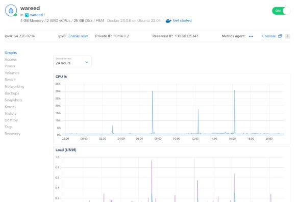
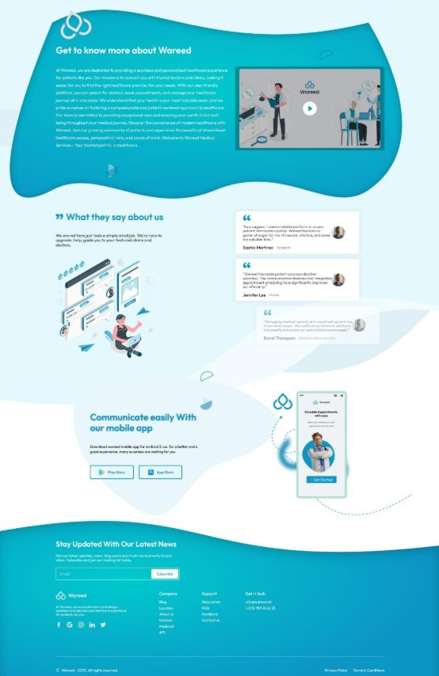
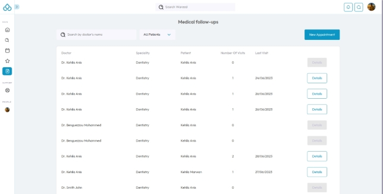
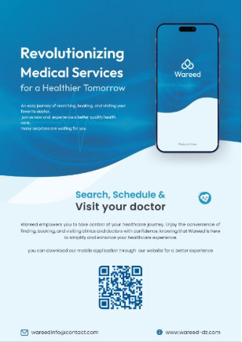

** République Algérienne Démocratique et Populaire 

Ministère de l'Enseignement Supérieur et de la Recherche Scientifique Université M'hamed Bougara - Boumerdès 

Faculté des Sciences \
Département d’Informatique 

**Domaine   :** Mathématiques Informatique   

**Filière    :** Informatique 

**Spécialité  :** Développement Web et Infographie  N° de l’Arrêté d’habilitation de la spécialité : arrêté n °002 du 03/01/2021 

***Mémoire de fin d’études en vu de l’obtention du***  

***Diplôme de Licence Professionnelle***    

***Thème*** 

**Wareed, plateforme de gestion de** 

**rendez-vous médicaux online** 

***Présenté par :                                                          Supervisé par :* BADJI** Abdelhadi                                                    **BELKACMI**  Djamal **BENGUEZZOU** Mohammed 

**IDJA** Mohamed Ouanis 

**KEHILA** Anis*** 

***Soutenu le  09/07/2023 Devant le jury composé de*** 

**SIACI** Redouane : Examinateur  

**HAMMICHE** Mokhtar : Président  

![ref1] Table de matières  ![ref2]

**Table de matières** 

[**TABLE DE MATIERES ................................................................................................................................ 2 ](#_page1_x69.00_y72.92)**TABLE DES FIGURES.................................................................................................................................. 5 INTRODUCTION........................................................................................................................................... 7**

**CHAPITRE I ETUDE PREALABLE ................................................................................................... 8**

I.1. INTRODUCTION ....................................................................................................................................... 8 I.2. PROBLÉMATIQUES .................................................................................................................................. 8 I.3. SOLUTION ET OBJECTIF ........................................................................................................................... 9 I.4. AVANTAGES DE PROJET .......................................................................................................................... 9 I.5. CONCLUSION ........................................................................................................................................ 10

**CHAPITRE II PLANIFICATION ET CONCEPTION UX ............................................................... 11**

II.1. INTRODUCTION .................................................................................................................................... 11 II.2. PLANIFICATION DE PROJET .................................................................................................................. 11 II.2.1. Méthode de planification ............................................................................................................ 11 II.2.2. Planification ................................................................................................................................ 12 II.3. EXPERIENCE D’UTILISATEUR (UX) ...................................................................................................... 13 II.3.1. Recherche ................................................................................................................................... 13 II.3.2. Empathie ..................................................................................................................................... 14

1) Personas utilisateur ........................................................................................................................................ 14
1) Scenarios d’utilisations .................................................................................................................................. 17

II.4. CONCEPTION DE SYSTEME D’INFORMATION......................................................................................... 18 II.4.1. Identification des acteurs ............................................................................................................ 19 II.4.2. Diagramme de cas d’utilisation................................................................................................... 19 II.4.3. Diagrammes de séquence ............................................................................................................ 22 II.4.4. Diagrammes de base de données ................................................................................................ 26

1) Diagramme entité-relation ............................................................................................................................. 26
1) Diagramme de base de données ..................................................................................................................... 28

II.5. CONCLUSION ....................................................................................................................................... 29 **CHAPITRE III IMPLEMENTATION ET DEVELOPPEMENT....................................................... 30**

III.1. INTRODUCTION................................................................................................................................... 30 III.2. ARCHITECTURE .................................................................................................................................. 30 III.3. ENVIRONNEMENT ............................................................................................................................... 31 III.3.1. Matériel (hardware) ................................................................................................................... 31 III.3.2. Logiciel (software) .................................................................................................................... 32 III.4. API (BACK-END SERVER) ................................................................................................................... 34 III.4.1. Technologies et outils utilisée (sur Back-end) ........................................................................... 34

1) Node JS .......................................................................................................................................................... 34

2 ![ref3]
![ref1] Table de matières  ![ref2]

2) Express JS ..................................................................................................................................................... 35
2) Typescript ...................................................................................................................................................... 35
2) Zod ................................................................................................................................................................ 36
2) Prisma ............................................................................................................................................................ 36
2) Docker ............................................................................................................................................................ 38
2) PostgreSQL ................................................................................................................................................... 38
8) Redis .............................................................................................................................................................. 38
8) Mongo DB ...................................................................................................................................................... 39
8) Pour quoi trois bases de données ? ................................................................................................................. 39

III.4.2. Déploiement .............................................................................................................................. 40

1) Digital Ocean ................................................................................................................................................. 40
1) Ngnix ............................................................................................................................................................. 40
1) Godaddy ........................................................................................................................................................ 41
1) Certbot ........................................................................................................................................................... 41

III.5. SITE WEB (FRONT-END) ...................................................................................................................... 43 III.5.1. Technologies et outils utilisée (Front-end) ................................................................................ 43

1) Vite ................................................................................................................................................................ 43
1) React JS ......................................................................................................................................................... 43
1) React Query ................................................................................................................................................... 44
1) MapBox ......................................................................................................................................................... 44
1) Material UI .................................................................................................................................................... 45

III.5.2. L’interface utilisateur du site ..................................................................................................... 46

1) Landing page ................................................................................................................................................. 46
1) Connexion ..................................................................................................................................................... 48
1) Inscreption ..................................................................................................................................................... 48
1) List de rendez-vous -docteur ......................................................................................................................... 49
1) Page de gestion des patients -docteur ............................................................................................................ 50
1) List de patients -docteur ................................................................................................................................. 50
1) Paramètre de clinique -docteur ...................................................................................................................... 51
1) Liste des employés -docteur .......................................................................................................................... 52
1) Overview -docteur .......................................................................................................................................... 52
1) Accueil –patient.............................................................................................................................................. 53
11) Recherche ...................................................................................................................................................... 53
11) Dossiers medicaux -patient............................................................................................................................. 55

III.6. APPLICATION MOBILE ........................................................................................................................ 56 III.6.1. Technologies et outils utilisée (app mobile) .............................................................................. 56

1) Expo............................................................................................................................................................... 56
1) React Native .................................................................................................................................................. 56
1) NativeBase ..................................................................................................................................................... 57
1) React Navigation ........................................................................................................................................... 57

III.6.2. L’interface utilisateur d’application mobile .............................................................................. 58

1) Welcome page ............................................................................................................................................... 58
1) Connexion ..................................................................................................................................................... 59
1) Inscreption ..................................................................................................................................................... 60

3 ![ref3]
![ref1] Table de matières  ![ref2]

4) Accueil et menu ............................................................................................................................................. 61
4) Recherche ...................................................................................................................................................... 62
4) Profil clinique ................................................................................................................................................. 63
4) Rendez-vous .................................................................................................................................................. 65

III.7. CONCLUSION ...................................................................................................................................... 66 **CHAPITRE IV WAREED –  IDENTITE VISUELLE......................................................................... 67**

IV.1. INTRODUCTION............................................................................................................................. 67 IV.2. LOGO................................................................................................................................................ 67 IV.2.1. Le choix du nom ........................................................................................................................ 67

.IV.2.2 Le choix du logo ..................................................................................................................... 67

IV.2.3. La méthode de conception ......................................................................................................... 68 IV.3. LA TYPOGRAPHIE ......................................................................................................................... 69 IV.3.1. Polices latines ............................................................................................................................ 69

1) Outfit font ...................................................................................................................................................... 69
1) Poppins font................................................................................................................................................... 69

IV.3.2. Police Arabe .............................................................................................................................. 69

a) Madani arabic ................................................................................................................................................ 69

IV.4. PALETTE DE COULEURS.............................................................................................................. 70 IV.4.1. Capri Blue ................................................................................................................................. 70 IV.4.2. Blue green ................................................................................................................................. 70 IV.5. PAPETERIE & IMAGINATION VISUELLE ............................................................................................... 71 IV.5.1. Conception ................................................................................................................................ 71 IV.5.2. POSTER .................................................................................................................................... 73

1) Concept design .............................................................................................................................................. 73
1) Les versions ................................................................................................................................................... 73
1) Développement du contenu ........................................................................................................................... 73

IV.5.3. Banner ....................................................................................................................................... 75

1) Concept design .............................................................................................................................................. 75
1) Développement du contenu ........................................................................................................................... 75
1) Éléments visuels ............................................................................................................................................ 76

IV.5.4. FLYER (Brochure) .................................................................................................................... 77

1) Concept design .............................................................................................................................................. 77
1) Développement du contenu ........................................................................................................................... 78

IV.6. VIDEO ANIMATION ............................................................................................................................. 79 IV.6.1. Scènes de video ......................................................................................................................... 79

1) Présentation du problème............................................................................................................................... 79
1) Présentation de la solution ............................................................................................................................. 80
3) Description du processus ............................................................................................................................... 81
3) Résultat .......................................................................................................................................................... 81

IV.7. CONCLUSION...................................................................................................................................... 82 **CONCLUSION ............................................................................................................................................. 83**

4 ![ref3]
![ref1] Table des figures  ![ref2]

**Table des figures** 

**Chapitre II Planification et conception UX**  

[Figure II:1 Tableau de planification de projet..................................................................... 12 ](file:///D:/Rapport-PFE.docx%23_Toc139246104)Figure II:2 Diagramme de Gantt de planification de projet ................................................ 13 Figure II:3 Personna de medcin .......................................................................................... 16 Figure II:4 Perssonna de patient .......................................................................................... 17 [Figure II:5Diagramme de cas d'utilisation .......................................................................... 20 ](file:///D:/Rapport-PFE.docx%23_Toc139246108)Figure II:6 Diagramme de séquence "authentification" ...................................................... 23 Figure II:7 Diagramme de séquence "Prendre rendez-vous" .............................................. 24 Figure II:8 Diagramme de séquence "Gestion des rendez-vous" ........................................ 25 [Figure II:9 Diagramme d'entité-relation.............................................................................. 27 ](file:///D:/Rapport-PFE.docx%23_Toc139246112)Figure II:10 Diagramme de base de données ...................................................................... 28

**Chapitre III Implémentation et développement** 

Figure III:1 Schéma d'architecture ...................................................................................... 31 [Figure III:2 Les composants de Prisma ............................................................................... 37 ](file:///D:/Rapport-PFE.docx%23_Toc139246115)[Figure III:3 Requet SQL ..................................................................................................... 37 ](file:///D:/Rapport-PFE.docx%23_Toc139246116)[Figure III:4 Requet Prisma .................................................................................................. 37 ](file:///D:/Rapport-PFE.docx%23_Toc139246117)[Figure III:5 VPS sur Digital ocean...................................................................................... 41 ](file:///D:/Rapport-PFE.docx%23_Toc139246118)[Figure III:6 Example: Logs d'API ....................................................................................... 42 ](file:///D:/Rapport-PFE.docx%23_Toc139246119)[Figure III:7 Droplet & domain - Digital ocean ................................................................... 42 ](file:///D:/Rapport-PFE.docx%23_Toc139246120)[Figure III:8 Wareed, Landing page ..................................................................................... 47 ](file:///D:/Rapport-PFE.docx%23_Toc139246121)[Figure III:9Les étapes d'inscreption .................................................................................... 49 ](file:///D:/Rapport-PFE.docx%23_Toc139246122)[Figure III:10 List de rendez vous –docteur ......................................................................... 49 ](file:///D:/Rapport-PFE.docx%23_Toc139246123)Figure III:11 Gestion des patients -docteur ......................................................................... 50 Figure III:12 Liste de patients –docteur .............................................................................. 50 [Figure III:13 Paramètre de clinique -docteur ...................................................................... 51 ](file:///D:/Rapport-PFE.docx%23_Toc139246126)[Figure III:14 Liste des employés –docteur.......................................................................... 52 ](file:///D:/Rapport-PFE.docx%23_Toc139246127)[Figure III:15 Statistiques -docteur ...................................................................................... 52 ](file:///D:/Rapport-PFE.docx%23_Toc139246128)[Figure III:16 Accueil -patient.............................................................................................. 53 ](file:///D:/Rapport-PFE.docx%23_Toc139246129)[Figure III:17 Page recherche -patient .................................................................................. 53](file:///D:/Rapport-PFE.docx%23_Toc139246130)

5 ![ref3]
![ref1] Table des figures  ![ref2]

Figure III:18 Rendez vous -patient ..................................................................................... 54 [Figure III:19 Dossiers medicaux -patient ............................................................................ 55 ](file:///D:/Rapport-PFE.docx%23_Toc139246132)[Figure III:20 Welcome page - app mobile .......................................................................... 58 ](file:///D:/Rapport-PFE.docx%23_Toc139246133)[Figure III:21 Page de connexion – app mobile ................................................................... 59 ](file:///D:/Rapport-PFE.docx%23_Toc139246134)[Figure III:22 Page d'inscreption -app mobile ...................................................................... 60 ](file:///D:/Rapport-PFE.docx%23_Toc139246135)[Figure III:23 Page accueil -app mobile ............................................................................... 61 ](file:///D:/Rapport-PFE.docx%23_Toc139246136)[Figure III:24 Page de recherche -app mobile ...................................................................... 62 ](file:///D:/Rapport-PFE.docx%23_Toc139246137)[Figure III:25 Profil clinique -app mobile ............................................................................ 63 ](file:///D:/Rapport-PFE.docx%23_Toc139246138)[Figure III:26 Prise de rendez-vous -app mobile .................................................................. 64 ](file:///D:/Rapport-PFE.docx%23_Toc139246139)[Figure III:27Rendez vous -app mobile ............................................................................... 65](file:///D:/Rapport-PFE.docx%23_Toc139246140)

**Chapitre IV  Wareed - Identité visuelle** 

Figure IV:1 Logo -wareed ................................................................................................... 67 Figure IV:2 Insperation de logo-wareed ............................................................................. 68 Figure IV:3 système de grille -logo .................................................................................... 68 Figure IV:4 Évolution du logo ............................................................................................ 68 [Figure IV:5 Les fonts utilisé ............................................................................................... 69 ](file:///D:/Rapport-PFE.docx%23_Toc139246145)Figure IV:6 Pallette de couleurs .......................................................................................... 70 [Figure IV:7  Papetrie-1........................................................................................................ 71 ](file:///D:/Rapport-PFE.docx%23_Toc139246147)[Figure IV:8 Carte visite -papetrie ....................................................................................... 72 ](file:///D:/Rapport-PFE.docx%23_Toc139246148)[Figure IV:9 Papetrie -2........................................................................................................ 72 ](file:///D:/Rapport-PFE.docx%23_Toc139246149)[Figure IV:10 Poster -conception ......................................................................................... 74 ](file:///D:/Rapport-PFE.docx%23_Toc139246150)[Figure IV:11 Mockup de poster .......................................................................................... 75 ](file:///D:/Rapport-PFE.docx%23_Toc139246151)[Figure IV:12 Banner -conception........................................................................................ 76 ](file:///D:/Rapport-PFE.docx%23_Toc139246152)[Figure IV:13 Mockup de banner ......................................................................................... 77 ](file:///D:/Rapport-PFE.docx%23_Toc139246153)[Figure IV:14 Flyer -conception ........................................................................................... 78 ](file:///D:/Rapport-PFE.docx%23_Toc139246154)[Figure IV:15 Mockup de flyer ............................................................................................ 79 ](file:///D:/Rapport-PFE.docx%23_Toc139246155)[Figure IV:16 Présentation du problème -video ................................................................... 80 ](file:///D:/Rapport-PFE.docx%23_Toc139246156)[Figure IV:17 Présentaion du Solution -video...................................................................... 80 ](file:///D:/Rapport-PFE.docx%23_Toc139246157)[Figure IV:18 Description du processus -video.................................................................... 81 ](file:///D:/Rapport-PFE.docx%23_Toc139246158)[Figure IV:19 Résultat -video ............................................................................................... 81](file:///D:/Rapport-PFE.docx%23_Toc139246159)

6 ![ref3]
![ref1] Introduction  ![ref2]

**Introduction** 

Dans un monde en constante évolution, l'utilisation de la technologie est devenue essentielle pour repousser les limites et transformer de nombreux secteurs, y compris celui de la santé. Les avancées technologiques offrent des opportunités uniques pour améliorer les soins de santé, accroître l'efficacité des processus et offrir des expériences plus personnalisées aux patients.  

La nécessité d'intégrer la technologie dans le domaine de la santé est devenue évidente. Les défis auxquels le secteur est confronté, tels que la gestion efficace des dossiers médicaux, la coordination des soins et l'amélioration de l'expérience patient, peuvent être surmontés grâce à des solutions technologiques innovantes. 

Notre projet s'inscrit dans cette perspective en proposant une plateforme numérique qui facilite  l'accès  aux  soins  de  santé,  optimise  la  communication  entre  les  patients  et  les professionnels de la santé, et améliore la qualité globale des soins. Nous avons étudié en détail les besoins des patients et des praticiens, et avons conçu une solution intégrée qui combine une application web et une application mobile conviviales. 

L'utilisation de la technologie moderne est au cœur de notre projet. Nous avons adopté une architecture client-serveur, avec une API REST qui permet une interaction fluide entre notre site web, notre application mobile et notre base de données. Cela garantit que les informations médicales,  les  rendez-vous,  les  dossiers  et  les  fonctionnalités  de  communication  sont facilement accessibles et sécurisées. 

L'interface utilisateur de notre application est conçue pour offrir une expérience intuitive et agréable aux patients et aux professionnels de la santé. Grâce à des outils tels que Figma, nous avons créé des maquettes et des prototypes interactifs qui nous ont permis de recueillir les commentaires des utilisateurs et d'optimiser la convivialité de notre solution. 

Notre projet est une illustration concrète de l'importance de la technologie dans l'évolution du domaine de la santé. En combinant des technologies modernes telles que React, React Native, et bien d'autres, nous avons créé une plateforme innovante qui vise à améliorer l'accès aux soins de santé et à optimiser les processus de communication et de coordination entre les patients et les praticiens. 

Dans les chapitres suivants de ce rapport, nous détaillerons en profondeur les différentes phases de notre projet,  en mettant l'accent  sur  l'implémentation, le développement  et  les résultats obtenus. 

7 ![ref3]
![ref1] Chapitre i  Etude préalable  ![ref2]

**Chapitre I  Etude préalable** 

**I.1. Introduction** 

Avant de plonger dans les subtilités de notre projet, il est crucial de procéder à une analyse approfondie du problème à résoudre et de comprendre les avantages inhérents à le résoudre. Dans ce chapitre, nous explorerons les défis urgents au sein de l'industrie de la santé et expliquerons pourquoi la résolution de ces problèmes est non seulement impérative, mais présente également des avantages significatifs pour les patients, les médecins et le système de santé dans son ensemble. En comprenant le paysage problématique et les résultats positifs potentiels, nous pouvons jeter les bases de notre solution innovante qui vise à révolutionner la prestation des soins de santé. 

**I.2. Problématiques** 

Malgré les progrès rapides de la technologie et son adoption généralisée, il est surprenant de voir que de nombreuses cliniques et médecins s'appuient encore sur des méthodes obsolètes telles que le papier et le stylo pour planifier les rendez-vous et gérer les données des patients. Cette approche traditionnelle entraîne non seulement des inefficacités et des erreurs, mais limite également l'accessibilité et la commodité pour les patients qui recherchent des services de santé. 

De plus, le système actuel oblige souvent les patients à se rendre physiquement à la clinique pour prendre rendez-vous, ce qui cause des désagréments et du temps et des efforts inutiles. De plus, les patients ont souvent du mal à trouver des cliniques et des médecins à proximité, manquant d'informations sur leurs spécialités, leur disponibilité et leur emplacement. 

Ces défis mettent en évidence le besoin pressant d'une solution modernisée et rationalisée qui exploite la puissance de la technologie pour simplifier le processus de prise de rendez-vous, améliorer la gestion des données et améliorer l'expérience globale du patient. En tirant parti d'outils  numériques  innovants,  nous  pouvons  combler  le  fossé  entre  les  patients  et  les prestataires de soins de santé, permettant aux individus de trouver et de prendre facilement des rendez-vous avec les bons médecins tout en garantissant un flux de travail transparent et efficace pour les cliniques et les médecins. 

8 ![ref3]
![ref1] Chapitre i  Etude préalable  ![ref2]

**I.3. Solution et objectif** 

Notre solution vise à révolutionner la façon dont les rendez-vous sont planifiés et les informations sur les patients sont gérées, offrant une plateforme conviviale qui connecte de manière transparente les patients avec les cliniques et les médecins. En fournissant un centre centralisé de prestataires de soins de santé, ainsi que leurs spécialités, leur disponibilité et les détails  de leur emplacement, nous  permettons aux patients  de faire des choix  éclairés  et d'accéder aux soins dont ils ont besoin avec la plus grande commodité. 

Essentiellement, notre objectif est d'éliminer la dépendance à l'égard des systèmes papier archaïques, de simplifier le processus de prise de rendez-vous et d'améliorer l'expérience globale des patients dans le secteur de la santé. Grâce à la puissance de la technologie, nous nous  efforçons  d'améliorer  l'accessibilité,  l'efficacité  et  la  transparence,  inaugurant  une nouvelle ère de gestion moderne des soins de santé. 

**I.4. Avantages de projet** 

Notre solution offre une multitude d'avantages qui ont un impact positif sur les patients et les prestataires de soins de santé. Voici quelques avantages clés : 

1. Commodité et accessibilité : Notre plateforme offre aux patients la possibilité de prendre facilement des rendez-vous en ligne de n'importe où, à tout moment. Cela élimine le besoin de visites en personne ou de longs appels téléphoniques, ce qui simplifie le processus de prise de rendez-vous et fait gagner un temps précieux aux patients. 
1. Choix élargis : les patients ont accès à un répertoire complet de prestataires de soins de santé, y compris des médecins, des spécialistes et des cliniques. Ils peuvent explorer diverses options en fonction des spécialités, de l'emplacement, de la disponibilité et des avis des patients, ce qui leur permet de choisir le bon fournisseur qui correspond le mieux à leurs besoins. 
1. Gains de temps et d'efficacité : en numérisant les processus de prise de rendez-vous et de gestion des données des patients, les prestataires de soins de santé peuvent réduire considérablement les tâches administratives et la paperasserie. Cela leur permet de se concentrer davantage sur les soins aux patients et d'améliorer l'efficacité globale de leur pratique. 
1. Amélioration de l'expérience du patient : notre solution améliore l'expérience globale du patient en fournissant une interface transparente et conviviale. Les patients peuvent 

9 ![ref3]
![ref1] Chapitre i  Etude préalable  ![ref2]

facilement visualiser et gérer leurs rendez-vous, recevoir des rappels de rendez-vous et accéder  à leurs  antécédents  médicaux, le tout sur une plateforme centralisée. Cela favorise  un  meilleur  engagement,  une  meilleure  communication  et  une  meilleure satisfaction des patients. 

5. Disponibilité et transparence en temps réel : les patients peuvent voir la disponibilité en temps réel des médecins et des cliniques, ce qui leur permet de prendre des rendez-vous adaptés à leur emploi du temps. Ils gagnent également en transparence sur les temps d'attente, ce qui leur permet de prendre des décisions éclairées concernant leurs soins de santé. 
5. Sécurité et confidentialité des données : nous accordons la priorité à la sécurité et à la confidentialité des données des patients. Notre plateforme adhère à des mesures strictes de protection des données, garantissant que les informations des patients sont traitées de manière sécurisée et confidentielle. 

En offrant ces avantages, nous visons à améliorer l'expérience globale des soins de santé pour les patients et les prestataires de soins de santé. Notre solution rationalise les processus, améliore la communication et permet aux individus de prendre le contrôle de leur parcours de soins de santé, ce qui conduit finalement à de meilleurs résultats de santé et à un système de santé plus efficace. 

**I.5. Conclusion** 

En conclusion, notre projet vise à relever les défis pressants du secteur de la santé en offrant une solution modernisée qui révolutionne la façon dont les rendez-vous sont planifiés et les informations sur les patients sont gérées. En tirant parti de la technologie, nous nous efforçons d'améliorer l'accessibilité, la commodité et l'efficacité des services de santé pour les patients et les prestataires de soins de santé. 

Ce chapitre a mis en évidence le problème des systèmes papier obsolètes et les inconvénients rencontrés par les patients pour accéder aux services de santé. Nous avons identifié le besoin d'une plateforme numérique qui simplifie le processus de prise de rendez-vous, fournit des informations complètes sur les prestataires de soins de santé et améliore l'expérience des patients. Notre projet représente une avancée significative dans la modernisation du secteur de la santé. Grâce à notre solution innovante, nous nous efforçons d'améliorer l'expérience globale des soins de santé, en la rendant plus pratique, efficace et centrée sur le patient.

10 ![ref3]
![ref1] Chapitre ii  Planification et conception UX  ![ref2]

**Chapitre II  Planification et conception UX** 

**II.1. Introduction** 

Dans cette section, nous voyons la planification du projet, pour faire fonctionner le projet dans les meilleurs scénarios et appliquer le travail d'équipe. 

Cette section donne un résumé détaillé du processus d'étude et de conception de l'expérience utilisateur, pour que la plateforme réponde facilement aux besoins de l'utilisateur. Sauter pour montrer un peu les détails de la conception du système d'information 

**II.2. Planification de projet** 

Le plan de projet joue un rôle essentiel dans l'organisation et la gestion des tâches à réaliser dans un laps de temps défini. Son objectif principal est de permettre une organisation optimale des tâches, offrant ainsi une vision claire et précise de notre projet, tout en assurant une réalisation dans les délais impartis. 

En plus de sa fonction d'organisation, le plan de projet permet de définir clairement les responsabilités de chaque membre de l'équipe, en attribuant les tâches et en déterminant les attentes en termes de travail à accomplir. Il favorise la collaboration et renforce la cohésion d'équipe en offrant une structure solide pour mener à bien le projet. 

L'attribution des tâches au sein de l'équipe encourage chaque membre à accomplir son travail de manière efficace et à respecter les délais fixés. Chacun doit être conscient que tout retard peut avoir un impact sur l'ensemble de l'équipe et entraîner des retards supplémentaires. 

**II.2.1. Méthode de planification**  

Notre projet et organisé et planifié su le logiciel « Microsoft MS Project », Le projet sera découpé en 5 phases : 

- **Recherche et planification :** contient : trouver le sujet, trouver le nom du projet et le planning.** 
- **Concept :**  contient :  Conception  graphique,  Conception  Ui-Ux,  Video  animation, conception de system.** 
- **Développement  et  construction :**  contient :  développement  d’API,  site  web, application mobile, héberger et déployer, tester.** 
- **Résumé :** Business plan, rapport de projet, présentation de projet.** 

11 ![ref3]
![ref1] Chapitre ii  Planification et conception UX  ![ref2]

- **Soumission de projet.** 

**II.2.2. Planification** 

*Figure II:1 Tableau de planification de projet*

12 ![ref3]
![ref1] Chapitre ii  Planification et conception UX  ![ref2]

*Figure II:2 Diagramme de Gantt de planification de projet* 

**II.3. Expérience d’utilisateur (UX)** 

Dans  ce  projet,  nous  reconnaissons  l'importance  primordiale  d'étudier  l'expérience utilisateur (UX) pour créer un système performant et centré sur l'utilisateur. La conception UX se concentre sur la compréhension des besoins, des préférences et des comportements des utilisateurs, et sur la conception d'un système intuitif et engageant qui offre une expérience transparente et satisfaisante. En étudiant attentivement l'expérience utilisateur, nous pouvons nous assurer que notre système est non seulement fonctionnel et efficace, mais aussi agréable et agréable et répond aux besoins de nos utilisateurs. 

**II.3.1. Recherche** 

L’objectif de la phase de recherche est : de comprendre et de définir les objectifs du site en faisant des recherches sur le marché (clients potentiels et autres sites similaires). 

13 ![ref3]
![ref1] Chapitre ii  Planification et conception UX  ![ref2]

Au cours de cette phase, nous avons : 

- Recherché des sites Web similaires 
- Défini les objectifs de notre site Web 
- Rencontré des utilisateurs potentiels (médecins et patients) 
- Défini les objectifs de l'utilisateur  

Et voici quelques sites actifs sur le marché algérien 

- beesiha.com 
- sihhatech.com 
- med.tn 
- doctolib.fr 
- maiia.com 

**II.3.2. Empathie** 

L'objectif de la carte d'empathie est 

- Supprimer les préjugés de nos conceptions et aligner l'équipe sur une compréhension unique et partagée de l'utilisateur 
- Découvrir les faiblesses de nos recherches 
- Découvrez les  besoins  de l'utilisateur dont  l'utilisateur lui-même n'est  peut-être même pas conscient 
- Comprendre ce qui motive les comportements des utilisateurs. 

Dans cette phase, nous avons passés sur par 3 étapes : 

1) Créer des personas utilisateur 
1) Définir des scénarios utilisateurs 
1) Conception de système d’information 

Les résultats pour chaque étape étaient les suivants : 

1) **Personas utilisateur**

Dans cette étape, nous réalisons des entretiens avec plusieurs médecins et patients. 

Et ce sont les questions que nous leur avons posées : 

**Les médecins :** 

- Comment gérez-vous actuellement vos rendez-vous patients ? 

14 ![ref3]
![ref1] Chapitre ii  Planification et conception UX  ![ref2]

- Avez-vous déjà utilisé des plateformes en ligne pour entrer en contact avec des patients ? Si oui, quelle a été votre expérience ? 
- Quels sont les facteurs les plus importants dont vous tenez compte lors du choix d'une plateforme de services médicaux ? 
- Quelles sont les fonctionnalités que vous trouveriez utiles dans une plateforme de services médicaux pour planifier des rendez-vous et gérer les informations sur les patients ? 
- Quels  défis  avez-vous  rencontrés  dans  la  prestation  de  services  médicaux  aux patients ? 
- Comment préférez-vous communiquer avec vos patients ? 
- Quelles sont les plaintes ou les problèmes courants des patients que vous rencontrez et comment les traitez-vous actuellement ? 
- Comment gérez-vous généralement les annulations de patients et les changements de rendez-vous ? 
- Dans quelle mesure est-il important pour vous de pouvoir consulter les avis et les évaluations des patients ? 
- Y a-t-il des préoccupations concernant ce site ? Ou des raisons qui vous font annuler son utilisation ? 
- Que pensez-vous de la télémédecine et des rendez-vous virtuels ? 

**Les patients :** 

- Quels sont les facteurs les plus importants que vous considérez lors du choix d'un fournisseur de services médicaux ? 
- Avez-vous  déjà  utilisé  une  plateforme  en  ligne  pour  prendre  des  rendez-vous médicaux ? Si oui, quelle a été votre expérience ? 
- À quel point est-il important pour vous de pouvoir prendre rendez-vous en ligne ? 
- Comment préférez-vous communiquer avec les prestataires de soins de santé (par exemple, téléphone, e-mail, appel vidéo, en personne) ? 
- Dans quelle mesure est-il important pour vous de pouvoir consulter vos dossiers médicaux ou vos résultats de tests en ligne ? 
- Comment payez-vous généralement les services de santé (par exemple, assurance, débours) ? 

15 ![ref3]
![ref1] Chapitre ii  Planification et conception UX  ![ref2]

- Avez-vous déjà eu une expérience négative avec un fournisseur de soins de santé ? Si oui, pouvez-vous décrire ce qui s'est passé et comment cela a été résolu (le cas échéant) ? 
- Y a-t-il des points douloureux ou des défis auxquels vous avez été confrontés lors de la recherche de services médicaux ? 
- Comment préférez-vous communiquer avec votre fournisseur de soins de santé ? 

Après  de  nombreux  entretiens,  nous  avons  résumé  leurs  réponses  dans  ces  deux personas : 

*Figure II:3 Personna de medcin* 

16 ![ref3]
![ref1] Chapitre ii  Planification et conception UX  ![ref2]

*Figure II:4 Perssonna de patient* 

2) **Scenarios d’utilisations** 

**Sarah** est une professionnelle occupée qui souhaite trouver un médecin rapidement et facilement. Elle visite votre site Web pour rechercher des médecins disponibles dans sa région et utilise des filtres pour affiner ses options en fonction de l'emplacement, de la spécialité et de la couverture d'assurance. Elle est heureuse de trouver plusieurs médecins qui répondent à ses critères et de prendre rendez-vous en ligne. 

**Badro** est un étudiant qui veut trouver une clinique à bas prix pour une blessure mineure. Il a un budget serré et veut trouver une clinique qui offre des services abordables. Il visite votre site Web pour rechercher des cliniques dans sa région et il compare les prix des différentes cliniques pour trouver l'option la plus rentable. 

**Mohammed** est un homme d'âge moyen qui souhaite trouver un médecin expérimenté dans le traitement de son état de santé. Il a entendu de bonnes choses au sujet d'un médecin en particulier de la part de ses amis et souhaite prendre rendez-vous avec ce médecin. Il visite votre site Web pour rechercher le médecin et lit les avis d'autres patients qui ont vu le médecin. Il est satisfait des critiques et prend rendez-vous avec le médecin. 

17 ![ref3]
![ref1] Chapitre ii  Planification et conception UX  ![ref2]

**Chanez** est une maman qui souhaite trouver un pédiatre pour son enfant. Elle s'inquiète de la qualité des soins que recevra son enfant et souhaite trouver un médecin qui a de l'expérience dans le traitement des enfants. Elle visite votre site Web pour rechercher des pédiatres dans sa région et lit les avis d'autres parents qui ont emmené leurs enfants chez le médecin. Elle choisit un médecin avec de bonnes critiques et prend rendez-vous pour son enfant. 

**II.4. Conception de système d’information** 

Pour cette étape de notre travail, nous utiliserons UML, ou « *Unified Modeling Language* », est un langage graphique (modélisation) largement utilisé pour représenter et schématiser les systèmes d'information de manière à la fois graphique et textuelle. Il offre une approche structurée pour comprendre, décrire et documenter les besoins d'un système, ainsi que pour concevoir des solutions efficaces. 

Le  choix  d'utiliser  UML  comme  langage  de  modélisation  repose  sur  ses  nombreux avantages: 

1. Visualisation  du  système  :  UML  permet  de  représenter  visuellement  les  différents composants et interactions d'un système, ce qui facilite la compréhension de sa structure et de son fonctionnement. 
1. Types de diagrammes variés : UML propose une variété de diagrammes, tels que les diagrammes  de  cas  d'utilisation,  les  diagrammes  de  classes,  les  diagrammes  de séquence, etc. Chaque type de diagramme se concentre sur un aspect spécifique du système, offrant ainsi une vue complète et détaillée. 
1. Compréhension des systèmes complexes : Grâce à sa capacité à modéliser les systèmes complexes, UML permet de visualiser les relations et les interactions entre les différents composants, ce qui facilite la compréhension des systèmes de grande envergure. 
1. Langage formel et normalisé : UML est un langage formel, ce qui signifie qu'il suit des règles et des normes précises. Cela garantit une précision et une cohérence dans la représentation des concepts et des relations entre les éléments du système. 
1. Langage universel : UML est un langage standard reconnu et utilisé dans l'industrie du développement logiciel. Cela signifie que les modèles UML sont compréhensibles et interprétables par les développeurs et les parties prenantes du projet, quel que soit leur contexte ou leur domaine d'expertise. 

18 ![ref3]
![ref1] Chapitre ii  Planification et conception UX  ![ref2]

**II.4.1. Identification des acteurs** 

Avant d'entamer la création des différents diagrammes, il est crucial de mentionner les acteurs impliqués dans notre système d'information. Les acteurs sont les parties prenantes qui interagissent avec le système et jouent un rôle clé dans son fonctionnement. En identifiant ces acteurs,  nous  pouvons  mieux  comprendre  leurs  besoins,  leurs  responsabilités  et  leurs interactions avec le système, ce qui nous permet de concevoir des solutions appropriées et efficaces. 

Acteurs : 

1) **Patient  :**  Représente  les  personnes  qui  recherchent  des  services  médicaux  et souhaitent prendre rendez-vous avec un médecin. 
1) **Médecin :** Représente les professionnels de la santé qui fournissent des services médicaux et gèrent les rendez-vous avec les patients. Le médecin doit créer une clinique pour être visible par les patients et permettre la prise de rendez-vous. 
1) **Administrateur  système**  :  Représente  l'administrateur  qui  gère  la  plateforme, vérifie les comptes des médecins et assure le bon fonctionnement du système. 

**II.4.2. Diagramme de cas d’utilisation** 

Le diagramme des cas d'utilisation représente les besoins et les fonctionnalités du système, ainsi que les utilisateurs et leurs relations. Il comprend des éléments tels que les acteurs, les cas d'utilisation, les relations d'inclusion, les relations d'extension et les relations de généralisation. 

- Acteur : Il s'agit d'une entité qui participe à une ou plusieurs actions ou situations dans le système. 
- Cas d'utilisation : Il décrit l'interaction entre un acteur et le système. 
- Relation d'inclusion (include) : Un cas d'utilisation inclut un autre cas d'utilisation, et son déroulement dépend de la résolution du second cas. 
- Relation d'extension (extend) : Un cas d'utilisation étend de manière optionnelle un autre cas d'utilisation. 

Ces  éléments  permettent  de  représenter  de  manière  structurée  et  compréhensible  les interactions entre les acteurs et le système, ainsi que les différentes fonctionnalités offertes par celui-ci. 

19 ![ref3]
![ref1] Chapitre ii  Planification et conception UX  ![ref2]

*Figure II:5Diagramme de cas d'utilisation* 

20 ![ref3]
![ref1] Chapitre ii  Planification et conception UX  ![ref2]

**Cas d'utilisation de patients :** 

- Créer un compte : le patient peut créer un nouveau compte pour accéder au système. 
- Connexion : Le patient peut se connecter à son compte pour accéder au système. 
- Recherche de cliniques : Le patient peut rechercher des cliniques en fonction de divers critères. 
- Prendre rendez-vous : Le patient peut prendre rendez-vous avec un médecin choisi dans une clinique spécifique. 
- Ajouter une clinique aux favoris : le patient peut ajouter une clinique à ses favoris pour un accès facile à l'avenir. 
- Voir historique : le patient peut afficher ses rendez-vous passés. 
- Annuler un rendez-vous : Le patient peut annuler un rendez-vous réservé. 
- Reporter  un  rendez-vous :  le  patient  peut  demander  à  reporter  un  rendez-vous réservé. 
- Prendre rendez-vous pour un membre de la famille : Le patient peut prendre rendez- vous pour un membre de sa famille. 
- Afficher les dossiers du médecin : le patient peut consulter les dossiers créés par le médecin, tels que les ordonnances et les fichiers de numérisation…. 
- Ajouter  un  avis  aux  cliniques  visitées :  le  patient  peut  ajouter  un  avis  ou  des commentaires sur une clinique visitée. 

**Cas d'utilisation du médecin :** 

- Créer un compte : Le médecin peut créer un nouveau compte pour accéder au système. 
- Connexion : Le médecin peut se connecter à son compte pour accéder au système. 
- Créer une clinique virtuelle : Le médecin peut créer une clinique virtuelle pour présenter ses services. 
- Gérer une clinique virtuelle : la clinique virtuelle doit être gérée par le médecin. 
- Modifier le profil de la clinique : Le médecin peut modifier le profil de sa clinique virtuelle. 
- Voir la liste des rendez-vous : le médecin peut consulter la liste des rendez-vous programmés avec lui. 
- Gérer les rendez-vous : Le médecin peut gérer les rendez-vous. 

21 ![ref3]
![ref1] Chapitre ii  Planification et conception UX  ![ref2]

- Prolonger le rendez-vous du patient : le médecin peut prolonger le rendez-vous d'un patient jusqu'à la prochaine session. 
- Reporter un rendez-vous : Le médecin peut reporter un rendez-vous existant.  
- Annuler un rendez-vous : Le médecin peut annuler un rendez-vous existant.  
- Gestion des dossiers médicaux pour le patient : le médecin peut créer un dossier pour un patient, tel que des ordonnances, des fichiers de numérisation, etc. 
- Gérer les médecins : les cliniques peuvent avoir plusieurs médecins, elles doivent être gérées 
- Inviter des médecins : peut inviter d'autres médecins à rejoindre sa clinique virtuelle. 
- Supprimer des médecins : peut supprimer les médecins existants dans la clinique. 
- Rejoindre  une  clinique :  le  médecin  peut  rejoindre  les  cliniques  en  acceptant l'invitation 

**II.4.3. Diagrammes de séquence** 

Les diagrammes de séquence sont des représentations graphiques des interactions entre les acteurs  et  le  système,  organisées  dans  un  ordre  chronologique.  Ils  permettent  de  décrire l'évolution d'un ensemble d'objets lors de l'exécution des cas d'utilisation. 

Les concepts clés de ce diagramme comprennent : 

- Les conditions conditionnelles (alternatives) avec "if [...] else [...]". 
- Les lignes de vie, qui représentent les participants à une interaction (objets ou acteurs). 
- Les messages, représentés par des flèches avec un texte, qui facilitent le dialogue entre les objets (acteurs, système, etc.). 

Chaque cas d'utilisation possède son propre diagramme de séquence, et voici quelques-uns des plus significatifs pour notre projet. 

22 ![ref3]
![ref1] Chapitre ii  Planification et conception UX  ![ref2]

- **Authentification** 

Lorsqu'un utilisateur, qu'il s'agisse d'un médecin ou d'un patient, accède à l'application, une page d'authentification est générée. L'utilisateur est alors invité à saisir son adresse e-mail et son mot de passe afin d'accéder à son compte. Ces informations d'identification sont vérifiées pour garantir l'accès sécurisé et personnalisé à l'application. 

*Figure II:6 Diagramme de séquence "authentification"* 

23 ![ref3]
![ref1] Chapitre ii  Planification et conception UX  ![ref2]

- **Prendre rendez-vous** 

Avant de pouvoir ajouter des rendez-vous, le patient doit d'abord s'authentifier. Une fois authentifié, il peut rechercher une clinique, en choisir une et ajouter un rendez-vous. Si l'ajout du rendez-vous est réussi, un message de succès s'affiche.  

*Figure II:7 Diagramme de séquence "Prendre rendez-vous"* 

24 ![ref3]
![ref1] Chapitre ii  Planification et conception UX  ![ref2]

- **Gestion des rendez-vous (docteur)** 

Dans cette partie nous voyons un exemple comment le médecin gère les rendez-vous dans son clinique, il doit être connecté à son compte et dans le tableau de bord de son clinique afin de voir les rendez-vous pris, il peut (modifier) annuler ou reporter le rendez-vous ... 

*Figure II:8 Diagramme de séquence "Gestion des rendez-vous"* 

25 ![ref3]
![ref1] Chapitre ii  Planification et conception UX  ![ref2]

**II.4.4. Diagrammes de base de données** 

L'élaboration de diagrammes de base de données est une étape cruciale dans le processus de développement  avant  de  créer  la  base  de  données  elle-même.  Dans  cette  section,  nous explorerons les diagrammes d'entité-relation (ERD) ainsi que les diagrammes de tables de base de données. Ces diagrammes fournissent une représentation visuelle claire de la structure des données, des entités et de leurs relations, ce qui facilite la conception et l'organisation de la base de données. En examinant ces diagrammes, nous serons en mesure de visualiser et de comprendre  la  structure  et  les  connexions  entre  les  différentes  entités  de  notre  système d'information. 

1) **Diagramme entité-relation** 

L'ERD (Entity-Relationship Diagram) est un outil de modélisation graphique utilisé pour représenter les entités, les relations et les attributs d'un système d'information. Il fournit une vue visuelle claire des différents éléments de données et de leurs interrelations. L'ERD se compose de formes géométriques, telles que des rectangles pour les entités, des losanges pour les relations et des lignes pour les connexions entre eux. 

L'ERD permet de décrire la structure logique d'une base de données et d'identifier les entités clés, les relations entre ces entités et les attributs associés. Il fournit une représentation visuelle précise  des  données  et  de  leur  organisation,  ce  qui  facilite  la  compréhension  et  la communication entre les parties prenantes du projet. 

En utilisant l'ERD, nous serons en mesure de concevoir efficacement la structure de notre base de données en identifiant les entités principales, les relations entre elles, les contraintes et les cardinalités. Cela nous aidera à créer une base de données bien structurée et cohérente, favorisant ainsi l'efficacité et l'intégrité des données dans notre système d'information. 

26 ![ref3]
![ref1] Chapitre ii  Planification et conception UX  ![ref2]

*Figure II:9 Diagramme d'entité-relation*

27 ![ref3]
![ref1] Chapitre ii  Planification et conception UX  ![ref2]

2) **Diagramme de base de données** 

*Figure II:10 Diagramme de base de données* 

28 ![ref3]
![ref1] Chapitre 2  Planification et conception UX  ![ref2]

**II.5. Conclusion** 

En conclusion, ce chapitre a couvert les aspects essentiels de notre projet. Nous avons commencé par planifier le projet à l'aide d'outils tels que MS Project et les diagrammes de Gantt, garantissant une organisation efficace des tâches et une allocation des ressources. Nous avons  ensuite  souligné  l'importance  d'étudier  l'expérience  utilisateur  (UX)  pour  créer  un système centré sur l'utilisateur. En comprenant les besoins des utilisateurs, nous pouvons concevoir  des  interfaces  intuitives  qui  améliorent  la  satisfaction.  De  plus,  nous  avons brièvement exploré les diagrammes UML, offrant un aperçu de la conception et de l'interaction du système. Ces informations nous guideront dans la prochaine phase de mise en œuvre, donnant vie à notre vision. 

29 ![ref3]
![ref1] Chapitre 3  Implémentation et développement  ![ref2]

**Chapitre III  Implémentation et développement** 

**III.1. Introduction** 

Dans ce chapitre, nous nous concentrons sur la réalisation de notre solution envisagée. Ce chapitre marque une étape cruciale où nous tirons parti de l'architecture Web et employons des technologies de pointe pour construire un système robuste et évolutif. En sélectionnant avec soin les bons outils et frameworks, nous visons à créer une expérience utilisateur transparente et à assurer les performances optimales de notre application. Tout au long de ce processus, nous mettons l'accent sur des pratiques de codage efficaces, des tests rigoureux et une itération continue pour fournir un produit de haute qualité qui dépasse les attentes des utilisateurs. 

**III.2. Architecture** 

Dans notre application web, nous adoptons une architecture client-serveur pour faciliter le flux transparent des données et des interactions. Le côté client représente l'interface utilisateur, qui est responsable de l'affichage de l'application sur le périphérique de l'utilisateur, que ce soit un navigateur web ou une application mobile. Du côté serveur, nous gérons la logique métier et  le  stockage  des  données.  Cette  séparation  nous  permet  d'assurer  la  scalabilité,  la maintenabilité et la sécurité du système. 

Pour permettre une communication efficace entre le client et le serveur, nous utilisons des API REST (Representational State Transfer). REST est un style architectural largement adopté qui exploite les protocoles HTTP pour la transmission des données. Il nous permet de définir un ensemble de points d'accès et de méthodes pour accéder et manipuler les données sur le serveur. En utilisant des API REST, nous pouvons connecter de manière transparente notre application web et notre application mobile à une infrastructure backend unifiée, garantissant ainsi  une  fonctionnalité  cohérente  et  une  synchronisation  des  données  sur  différentes plateformes. 

En mettant en œuvre cette architecture et en utilisant des API REST, nous pouvons offrir une expérience utilisateur fluide à la fois sur notre site web et notre application mobile. Les utilisateurs peuvent accéder au même ensemble de fonctionnalités et interagir avec le système depuis n'importe quel appareil, ce qui est pratique et flexible. De plus, cette approche simplifie le processus de développement et de maintenance, car nous pouvons nous concentrer sur la création d'API robustes et assurer la compatibilité avec différentes applications clientes 

30 ![ref3]
![ref1] Chapitre III  Implémentation et développement  ![ref2]

*Figure III:1 Schéma d'architecture* 

**III.3. Environnement** 

Pour la réalisation de ce travail, nous avons eu recours aux environnements suivants: 

**III.3.1. Matériel (hardware)** 

Nous en tant qu'équipe, nous avions développé le projet sur nos appareils personnels, nous mentionnons certaines de leurs caractéristiques 

|**PC - Brand** |ASUS |ASUS |ASUS |DELL |
| - | - | - | - | - |
|**CPU** |
Intel  

` `Core I7-3630QM  
|
Intel  

Core I5-6198DU  
|AMD  Ryzen 5 3500U |Intel Core I5-9300H |
|**RAM** |12 GB |8 GB |20 GB |8 GB |
|**GPU** |Nvidea Geforce  740 M |Nvidea Geforce 920 MX |Nvidea Geforce  MX 330 |Nvidea Geforce GTX 1050 |
|**OS** |
Ubuntu 

` `(64bit)
|
Windows 10  

(64 bit)
|
Ubuntu 

` `(64bit)
|
Fedora 

` `(64bit)
|
|**Storage** |128 GB SSD   1 TB HDD |256 GB SSD   1 TB HDD |128 GB SSD   1 TB HDD |128 GB SSD   1 TB HDD |

*Tableau III-1 Caractéristiques de matériaux* 

31 ![ref3]
![ref1] Chapitre III  Implémentation et développement  ![ref2]

**III.3.2. Logiciel (software)** 

Dans cette section, nous aborderons les logiciels que nous avons généralement utilisés pour développer les différentes parties de notre projet : 

- **Figma :** Figma est un outil de conception d'interface utilisateur basé sur  le cloud. Il permet aux concepteurs de créer, prototyper et collaborer sur  des designs d'interfaces graphiques pour des applications web et mobiles.  Figma offre une interface conviviale, des fonctionnalités de collaboration  en temps réel et la possibilité de créer des prototypes interactifs. C'est un outil populaire utilisé par de nombreux designers pour créer des expériences utilisateur de qualité. 
- **Visual Studio Code :** également connu sous le nom de VS Code, est  un  éditeur  de  code  source  gratuit  et  open-source  développé  par  Microsoft. Il est largement utilisé par les développeurs pour écrire du  code dans différents langages de programmation. VS Code offre de  nombreuses fonctionnalités telles que la coloration syntaxique, l'autocomplétion intelligente,  la  détection  d'erreurs,  le  débogage,  la  gestion  des  versions  et  une intégration  étendue  avec  des  outils  et  des  extensions.  Son  interface  utilisateur intuitive  et  sa  large  gamme  d'extensions  en  font  un  choix  populaire  parmi  les développeurs pour leur environnement de développement. 
- **Postman** **:** est un outil de développement d'API qui permet aux  développeurs de tester, déboguer et documenter facilement les API.  Il offre une interface conviviale qui permet d'envoyer des requêtes  HTTP vers des API et de recevoir les réponses correspondantes.  Postman permet de tester différentes méthodes HTTP telles que GET, POST, PUT, DELETE, etc., ainsi que de spécifier les paramètres, les en-têtes et les corps de requête. Il offre également des fonctionnalités avancées telles que la gestion des environnements, l'automatisation des tests, la génération de collections d'API, la collaboration en équipe et bien plus encore. Postman est un outil essentiel pour les développeurs travaillant avec des API, leur permettant de simplifier et d'accélérer le processus de développement et de débogage des API. 

32 ![ref3]
![ref1] Chapitre III  Implémentation et développement  ![ref2]

- **Adobe Illustrator :** est un logiciel de création graphique et de dessin  vectoriel largement utilisé dans l'industrie du design. Il offre un large  éventail  d'outils  et  de  fonctionnalités  qui  permettent  de  créer  des  illustrations, des logos, des icônes, des graphiques et d'autres éléments visuels de haute qualité. Illustrator utilise des vecteurs pour créer des images, ce qui signifie que les dessins peuvent être redimensionnés et modifiés sans perte de qualité. Il prend en charge la création de formes, le tracé de courbes, l'application de couleurs et  de dégradés, la manipulation  des calques et  bien plus  encore.  Illustrator est apprécié pour sa précision, sa flexibilité et sa capacité à produire des graphiques professionnels pour diverses applications telles que l'impression, le web, la publicité et les médias numériques. 
- **Adobe Photoshop :** est un logiciel de retouche d'image et de création  graphique largement utilisé dans le domaine de la conception, de la  photographie et du multimédia. Il offre une gamme complète d'outils  et  de  fonctionnalités  avancés  pour  manipuler  et  améliorer  les  images.  Avec Photoshop, vous pouvez effectuer des retouches précises, ajuster la luminosité et le contraste,  corriger  les  couleurs,  supprimer  des  objets  indésirables,  créer  des compositions complexes et bien plus encore.  
- **Adobe After Effects :** est un logiciel de composition vidéo et d'effets  visuels largement utilisé dans l'industrie du cinéma, de la télévision et  du multimédia. Il permet aux utilisateurs de créer des animations, des  effets spéciaux, des titres, des transitions et bien plus encore. Avec After Effects, vous pouvez combiner des éléments visuels, tels que des images, des vidéos et des graphiques, pour créer des séquences dynamiques et percutantes. 
- **GitHub :**  est une plateforme de développement collaboratif basée sur  Git, un système de contrôle de version distribué. Il est largement  utilisé par les développeurs pour héberger, gérer et partager des projets  de développement de logiciels. Sur GitHub, les développeurs peuvent 

  créer des dépôts pour stocker leur code source, collaborer avec d'autres développeurs via des demandes de tirage (pull requests), suivre les modifications apportées au 

33 ![ref3]
![ref1] Chapitre III  Implémentation et développement  ![ref2]

code, gérer les problèmes et les demandes de fonctionnalités, et bien plus encore. Il facilite le travail en équipe, la contribution ouverte et la gestion efficace des versions de code. De plus, GitHub offre des fonctionnalités telles que le suivi des problèmes, l'intégration continue, l'hébergement de pages Web et la documentation des projets. C'est un outil essentiel pour les développeurs qui souhaitent partager et collaborer sur des projets de manière transparente. 

**III.4. API (Back-end server)** 

Une API, ou Interface de Programmation d'Application, est un ensemble de règles et de protocoles qui permettent à différentes applications de communiquer entre elles. Dans notre projet, nous avons développé notre back-end en tant qu'API, ce qui nous permet de l'utiliser à la fois pour notre site web et notre application mobile. 

En utilisant une API, nous avons pu fournir une interface cohérente pour accéder aux fonctionnalités et aux données de notre système, quelle que soit la plateforme utilisée. Cela nous a permis de réduire les efforts de développement et de maintenance, car nous n'avons eu qu'à implémenter et à gérer une seule API pour les deux fronts. 

L'utilisation d'une API form a également offert une flexibilité et une extensibilité accrues. En ajoutant de nouvelles fonctionnalités ou en mettant à jour notre système, nous pouvons simplement mettre à jour l'API form et les modifications seront reflétées à la fois sur le site et l'application. 

**III.4.1. Technologies et outils utilisée (sur Back-end)** 

Nous mentionnons donc ici certaines des technologies utilisées dans notre API : 

1) **Node JS**  

Node.js est un environnement d’exécution single-thread, open-source et  multi-plateforme permettant de créer des applications rapides et évolutives côté  serveur et en réseau. Il fonctionne avec le moteur d’exécution JavaScript V8 et  utilise une architecture d’E / S non bloquante et pilotée par les événements, ce  qui le rend efficace et adapté aux applications en temps réel. Node.js n’est pas un langage de programmation. Il s’agit plutôt d’un environnement d’exécution qui est utilisé pour exécuter JavaScript en dehors du navigateur. 

34 ![ref3]
![ref1] Chapitre III  Implémentation et développement  ![ref2]

Node.js n’est pas non plus un framework (une plateforme pour développer des applications logicielles).  Le  moteur  d’exécution  de  Node.js  est  construit  au-dessus  d’un  langage  de programmation – dans ce cas, JavaScript – et permet de faire fonctionner les frameworks eux- mêmes. 

2) **Express JS** 

Express.js,  parfois  aussi  appelé  «  Express  »,  est  un  framework backend Node.js minimaliste, rapide et de type  Sinatra qui offre des fonctionnalités et des outils robustes  pour développer des applications backend évolutives. Il vous offre le système de routage et des fonctionnalités simplifiées pour étendre le framework en développant des composants et des parties plus puissants en fonction des cas d’utilisation de votre application. 

` `Ce framework fournit un ensemble d’outils pour les applications web, les requêtes et les réponses HTTP, le routage et les intergiciels permettant de créer et de déployer des applications à grande échelle, prêtes pour l’entreprise. 

3) **Typescript** 

TypeScript est un langage de programmation développé par Microsoft en  2012.  Son  ambition  principale  est  d’améliorer  la  productivité  de  développement  d’applications  complexes.  C’est  un  langage  open  source,  développé comme un sur-ensemble de Javascript. Ce qu’il faut comprendre,  c’est que tout code valide en Javascript l’est également en TypeScript. Cependant, ce langage introduit des fonctionnalités optionnelles comme le typage ou la programmation orientée objet. Pour bénéficier de ces fonctionnalités, aucune librairie n’est requise. Il suffit d’utiliser l’outil de compilation de TypeScript pour le transpiler (compiler le code source d’un langage en un autre langage) en Javascript. Ainsi, le code exécuté sera un équivalent Javascript du code TypeScript compilé. 

- **Pourquoi TypeScript ?** 

Si vous êtes un développeur Javascript, le langage TypeScript est du Javascript viable. Pour vous, Typescript est une JS linter dans le sens où, les contraintes demandées par TypeScript sont plus fortes que pour le Javascript. 

Dans le cas des développeurs backend (C# ou Java), en apprenant le TypeScript vous évitez des erreurs simples remontées par le compilateur. 

35 ![ref3]
![ref1] Chapitre III  Implémentation et développement  ![ref2]

- **Les avantages de TypeScript** 
- Langage typé 
- Compilation en différentes versions ECAMScript à partir de la version 3 
- De nombreux outils sont disponibles 
- Un langage orienté objet avec l’introduction du typage, de l’héritage ou encore les notions de public et private 
- La transition du Javascript vers le TypeScript peut se faire progressivement par l’introduction au fur et à mesure de types 
- La transition inverse très simple grâce à la transpilation en ECAMScript 
4) **Zod** 

Zod est une bibliothèque de validation de schémas axée sur TypeScript. Elle  offre une API puissante et expressive pour définir et valider des schémas de  données. Avec Zod, vous pouvez facilement définir des règles de validation  complexes pour différents types de données tels que les chaînes de caractères, les nombres, les tableaux, les objets, et bien d'autres. Il prend en charge des fonctionnalités avancées telles que la validation conditionnelle, les messages d'erreur personnalisés et la composition de schémas. Zod favorise le typage fort et l'inférence de types, ce qui en fait un choix idéal pour les projets TypeScript. Il s'intègre également parfaitement avec des frameworks et des bibliothèques populaires comme React et Express. En résumé, Zod simplifie le processus de validation des données et contribue à assurer l'intégrité et la fiabilité des données de votre application. 

5) **Prisma** 

Prisma est un ORM, mais conçu de manière très différente de ce  qui se fait actuellement dans l'industrie. En général, les ORM sont  des bibliothèques qui font correspondre les tables de votre base de  données aux classes du langage que vous utilisez pour écrire votre programme. Prisma, quant à lui, est une boîte à outils de base de données. En plus, Prisma ne souffrirait pas des nombreux problèmes qui sont communément associés aux ORM. L'équipe estime en effet que l'approche des ORM traditionnels conduit à de nombreux problèmes causés par le décalage d'impédance objet-relationnel. 

C'est une situation que la conception de Prisma permettrait d'éviter. L'un des principaux différentiateurs entre Prisma et un ORM est son fichier de schéma centralisé et son langage de 

36 ![ref3]
![ref1] Chapitre III  Implémentation et développement  ![ref2]

schéma. Plutôt que d'avoir des classes dans votre application qui correspondent aux entités de la base de données, Prisma sépare vos modèles de base de données de votre code. 

En outre, la CLI de Prisma utilise ce fichier de schéma pour générer automatiquement un client qui peut être utilisé dans votre code TypeScript pour interagir avec la base de données. Ce paradigme est légèrement différent de celui d'un ORM, où les instances des classes de modèles jouent ce rôle.  

Pour en revenir à la composition de Prisma, voici ses trois principaux composants: 

*Figure III:2 Les composants de Prisma*

**Exemple** 

En prisma :                                                     En SQL:  

 

`  `*Figure III:3 Requet SQL Figure III:4 Requet Prisma*

37 ![ref3]
![ref1] Chapitre III  Implémentation et développement  ![ref2]

6) **Docker** 

Docker est une plateforme open-source qui permet de créer, déployer et  exécuter des applications dans des  conteneurs. Les  conteneurs sont des  environnements isolés et légers qui contiennent tout ce dont une application  a  besoin  pour  fonctionner,  y  compris  le  code,  les  dépendances  et  les  configurations. Docker simplifie le déploiement et la gestion des applications, en garantissant une portabilité et une cohérence entre les différents environnements de développement, de test et de production. Il permet également d'améliorer l'efficacité des ressources et de faciliter la mise à l'échelle horizontale des applications. 

7) **PostgreSQL** 

PostgreSQL est un système de gestion de base de données relationnelle  orienté objet puissant et open source qui est capable de prendre en charge en  toute sécurité les charges de travail de données les plus complexes. Alors que  MySQL donne la priorité à l'évolutivité et aux performances, Postgres donne  la priorité à la conformité et à l'extensibilité SQL. 

Les entreprises qui souhaitent maintenir un haut niveau d'intégrité et de personnalisation de leurs données choisissent généralement Postgres en raison de sa fiabilité, l'intégrité de ses données, la robustesse de ses fonctionnalités, et parce qu’il fournit des solutions toujours performantes  et  innovantes.  PostgreSQL  fonctionne  sur  tous  les  principaux  systèmes d'exploitation et est conforme à ACID depuis 2001. 

Postgres peut être téléchargé gratuitement et déployé sur du matériel standard, ou peut être exécuté dans le Cloud par le biais d'une variété de fournisseurs. Bien que Postgres soit riche en fonctionnalités et adapté aux charges de travail OLAP, les performances de Postgres ont tendance à atteindre une limite lorsque les volumes de données dépassent plusieurs téraoctets. 

8) **Redis** 

Redis est un magasin de structure de données clé/valeur en mémoire open  source rapide. Redis propose un ensemble de structures de données en mémoire  polyvalentes  qui  vous  permet  de  créer  facilement  un  large  éventail  d'applications personnalisées. Les principaux cas d'utilisation de Redis comprennent la mise en cache, la gestion des sessions, la fonctionnalité pub/sub et les classements. Il s'agit du magasin clé/valeur le plus populaire à l'heure actuelle. Il est distribué sous licence BSD, écrit en code C 

38 ![ref3]
![ref1] Chapitre III  Implémentation et développement  ![ref2]

optimisé et prend en charge plusieurs langages de développement. Redis est l'acronyme de REmote DIctionary Server. 

Sa vitesse et sa facilité d'utilisation en font une solution de choix pour toutes les applications (web,  mobiles,  jeux,  technologies  publicitaires  et  Internet  des  objets)  qui  nécessitent  les meilleures performances.  

9) **Mongo DB** 

MongoDB est une base de données NoSQL orientée document. Elle se distingue  des  bases  de  données  relationnelles  par  sa  flexibilité  et  ses performances.  Découvrez  tout  ce  que  vous  devez  savoir  sur  cet  outil incontournable pour l'ingénierie des données. 

Apparue au milieu des années 2000, MongoDB est une base de données NoSQL orientée document. Elle est utilisée pour le stockage de volumes massifs de données. 

Contrairement à une base de données relationnelle SQL traditionnelle, MongoDB ne repose pas sur des tableaux et des colonnes. Les données sont stockées sous forme de collections et de documents. Les documents sont des paires de valeurs / clés servant d’unité de données de base. Les collections quant à elles contiennent des ensembles de documents et de fonctions. Elles sont l’équivalent des tableaux dans les bases de données relationnelles classiques. 

10) **Pour quoi trois bases de données ?** 

Dans notre projet, nous utilisons trois types de bases de données différents pour répondre à nos besoins spécifiques. Tout d'abord, nous avons choisi PostgreSQL car il offre une prise en charge des relations entre les tables, ce qui est essentiel pour la gestion des données complexes et structurées. Bien que PostgreSQL puisse être un peu plus lent que certaines autres bases de données, il offre une grande robustesse et une grande fiabilité. 

Ensuite, nous utilisons Redis pour la mise en cache des codes « tokens ». Redis est une base de  données  en  mémoire  qui  stocke  les  données  sous  forme  de  paires  clé/valeur.  Il  est extrêmement rapide et efficace pour les opérations de lecture et d'écriture rapides, ce qui en fait un choix idéal pour la mise en cache des codes « tokens », qui doivent être récupérés rapidement lors des demandes d'authentification. 

Enfin,  nous  avons  opté  pour  MongoDB  pour  la  sauvegarde  des  événements  de  notre framework de gestion d'agenda, AgendaJS. MongoDB est une base de données NoSQL qui offre une grande flexibilité pour le stockage de données non structurées ou semi-structurées, 

39 ![ref3]
![ref1] Chapitre III  Implémentation et développement  ![ref2]

comme les événements de calendrier. Il nous permet de stocker facilement et efficacement ces événements tout en offrant des fonctionnalités avancées de requêtage et d'indexation. 

En combinant ces trois bases de données, nous sommes en mesure de répondre à nos besoins spécifiques en matière de relations de données, de performances rapides et de stockage flexible.  

**III.4.2. Déploiement** 

Afin de commencer à utiliser l'API, nous avons dû la mettre en ligne, en particulier lorsque nous traitons du site Web et de l'application mobile (le site Web est hébergé avec l'API), nous mentionnons ce que nous avons utilisé pour déployer notre produit : 

1) **Digital Ocean** 

Digital Ocean est une solution de service en cloud populaire, dotée d’une  infrastructure robuste et offrant de multiples services.  

Il est principalement utilisé pour l’hébergement d’applications et de sites web  et est préféré par les utilisateurs en raison de sa facilité d’utilisation. Les centres de données Digital Ocean offrent un haut niveau de sécurité pour les applications. 

Les serveurs privés virtuels ou VPS offerts par Digital Ocean aux utilisateurs sont connus sous le nom de Droplets. Les utilisateurs de la plateforme peuvent gérer leurs applications par le biais d’une interface utilisateur Web ou d’une interface en ligne de commande (CLI). 

La plateforme IaaS de Digital Ocean est un choix populaire pour de nombreuses grandes entreprises clientes dans le monde entier en raison de sa fiabilité. Elle permet aux utilisateurs de choisir des paramètres tels que les centres de données pour les applications, la taille des droplets et la région géographique. 

2) **Ngnix** 

Nginx, prononcé comme « engine-ex », est un serveur web open-source qui,  depuis son succès initial en tant que serveur web, est maintenant aussi utilisé  comme reverse proxy, cache HTTP, et load balancer.  

Nginx a été créé à l’origine par Igor Sysoev, avec sa première sortie publique en octobre 2004. Igor a d’abord conçu le logiciel comme une réponse au problème du C10k, qui est un problème de performance lié à la gestion de 10.000 connexions simultanées. 

40 ![ref3]
![ref1] Chapitre III  Implémentation et développement  ![ref2]

Parce que ses racines sont dans l’optimisation des performances à l’échelle, Nginx surpasse souvent d’autres serveurs web populaires dans les tests de benchmarks, en particulier dans les situations avec un contenu statique et/ou des requêtes simultanées élevées 

3) **Godaddy** 

GoDaddy est le plus grand et le plus fiable des bureaux d'enregistrement de  domaine au monde. Il permet aux personnes de trouver des idées créatives pour  réussir en ligne. Rien de plus facile que d'acheter un nom de domaine avec un  outil de recherche de domaine, nous y avons acheté le domaine : « **www.wareed-dz.com** ». 

4) **Certbot** 

Certbot est un outil pratique qui permet d’automatiser la configuration de  certificats SSL/TLS pour des sites internet. Il est avantageux d’utiliser Certbot  pour protéger les données transmises entre un site web et le navigateur.  

De plus, l’utilisation de HTTPS améliore la fiabilité d’un site internet et possède donc un impact positif sur vos utilisateurs. 

Ainsi, en utilisant Certbot, vous pouvez améliorer la sécurité et la confidentialité de votre site internet. Il utilise Let's Encrypt, une autorité de certification gratuite et open-source 

*Figure III:5 VPS sur Digital ocean* 

41 ![ref3]
![ref1] Chapitre III  Implémentation et développement  ![ref2]

*Figure III:7 Droplet & domain - Digital ocean*

*Figure III:6 Example: Logs d'API* 

42 ![ref3]
![ref1] Chapitre III  Implémentation et développement  ![ref2]

**III.5. Site web (front-end)** 

Le front-end (site web) est l'endroit où l'utilisateur (patient ou médecin) interagira avec notre système 

**III.5.1. Technologies et outils utilisée (Front-end)** 

Nous mentionnons donc ici certaines des technologies utilisées dans notre Site web : 

1) **Vite** 

Vite  est  un  outil  de  développement  léger  et  rapide  pour  la  création  d'applications web basées sur JavaScript ou TypeScript. Conçu pour optimiser  le processus de développement, Vite offre une configuration zéro par défaut, ce  qui signifie que vous pouvez commencer à développer rapidement sans avoir à vous soucier de la configuration initiale du projet. 

Vite  utilise  une  approche  de  développement  basée  sur  les  modules  (module-based development) et tire parti de la puissance des navigateurs modernes pour fournir une expérience de développement rapide et fluide. Il offre des fonctionnalités telles que le rechargement instantané (instant reloading) qui permet de voir les changements en temps réel sans avoir besoin de recompiler l'ensemble de l'application. 

De plus, Vite prend en charge nativement les importations d'ES modules, ce qui permet un chargement rapide des dépendances. Il offre également une prise en charge des frameworks populaires tels que Vue.js et React, permettant aux développeurs de créer des applications performantes et réactives. 

2) **React JS** 

React est une bibliothèque JavaScript open-source utilisée pour la création  d'interfaces  utilisateur  interactives  et  réactives.  Développée  par  Facebook,  React permet de construire des applications web à une seule page (Single Page  Applications)  et  des  composants  réutilisables.  Sa  principale  caractéristique  est  la  gestion efficace des mises à jour du DOM (Document Object Model), ce qui rend les applications plus rapides et plus performantes. Grâce à son approche basée sur les composants, React facilite la construction d'interfaces modulaires et maintenables. Il est également compatible avec d'autres bibliothèques et frameworks JavaScript, ce qui permet une intégration flexible dans les projets existants.  

43 ![ref3]
![ref1] Chapitre III  Implémentation et développement  ![ref2]

Et bien sûr en parlant de react nous devrions aussi parler de ce que nous utilisons dans react: 

- **HTML :**  qui  signifie  HyperText  Markup  Language,  est  le  langage  de  balisage standard utilisé pour la création de pages web. Il  fournit une  structure et un formatage de base pour le contenu web, permettant aux  navigateurs de comprendre et d'afficher les éléments tels que le texte, les images, les liens et les vidéos. 
- **CSS :**  qui signifie Cascading Style Sheets, est un langage de feuille de  style utilisé pour décrire la présentation et le style des documents HTML.  Il permet de contrôler l'apparence visuelle des éléments d'une page web,  tels que la couleur, la taille, la police, la mise en page et les effets visuels. 
- **JavaScript** :  est un langage de programmation de haut niveau, dynamique  et orienté objet, principalement utilisé pour développer des applications  web interactives. Il est souvent intégré dans les pages HTML pour ajouter des fonctionnalités interactives et améliorer l'expérience utilisateur. 
3) **React Query** 

React Query est une bibliothèque de gestion de l'état et de gestion des  requêtes  pour  les  applications  React.  Elle  offre  une  approche  simple  et  déclarative pour gérer les requêtes HTTP, les mises en cache des données et la  gestion de l'état de manière efficace. Avec React Query, vous pouvez facilement effectuer des requêtes HTTP vers des API, gérer les états de chargement, les erreurs et les succès, et gérer la mise en cache des données pour une expérience utilisateur fluide et réactive. La bibliothèque prend en charge la mise en cache des données en mémoire, ainsi que le stockage des données en cache dans le navigateur ou dans un stockage externe tel que localStorage ou IndexedDB. 

En utilisant React Query, vous pouvez améliorer considérablement l'expérience utilisateur de votre application en optimisant les requêtes et en gérant efficacement l'état des données. Cela vous permet de réduire la complexité du code, d'améliorer les performances et de garantir une expérience utilisateur plus fluide. 

4) **MapBox** 

Mapbox  est  une  plateforme  de  cartographie  qui  fournit  des  outils  et  des  services pour intégrer des cartes interactives dans les applications web et mobiles.  Elle offre une large gamme de fonctionnalités pour visualiser, personnaliser et  interagir avec des cartes géographiques. 

44 ![ref3]
![ref1] Chapitre III  Implémentation et développement  ![ref2]

Mapbox fournit des API (interfaces de programmation d'applications) qui permettent aux développeurs d'intégrer des cartes dans leurs applications. Ces API offrent des fonctionnalités avancées telles que la navigation, le géocodage, le traçage d'itinéraire, la recherche de lieux, la superposition de données personnalisées et bien plus encore. Elles prennent en charge plusieurs types de cartes, y compris les cartes statiques, les cartes interactives et les cartes en 3D. 

5) **Material UI** 

Material-UI est une bibliothèque d'interface utilisateur (UI) populaire pour  le développement d'applications web avec React. Elle est basée sur les principes  du design Material, créé par Google. Material-UI fournit une vaste collection de  composants réutilisables et pré-conçus tels que des boutons, des formulaires, des barres de navigation, des cartes, des icônes, etc. Ces composants sont conçus pour être esthétiquement plaisants,  réactifs  et  faciles  à  utiliser.  Material-UI  offre  également  un  système  de  thème personnalisable qui permet aux développeurs de modifier facilement l'apparence et le style des composants  pour  s'adapter  à  leur  application.  En  utilisant  Material-UI,  les  développeurs peuvent créer des interfaces utilisateur attrayantes et cohérentes, tout en bénéficiant de la flexibilité et de la facilité de développement offertes par React.  

45 ![ref3]
![ref1] Chapitre III  Implémentation et développement  ![ref2]

**III.5.2. L’interface utilisateur du site**  

1) **Landing page** 

Il s'agit de la première page que l'utilisateur verra lorsqu'il entrera sur le site sans être connecté, elle contient une option de recherche de médecins et quelques informations sur nos services. 

46 ![ref3]
![ref1] Chapitre III  Implémentation et développement  ![ref2]

*Figure III:8 Wareed, Landing page*

47 ![ref3]
![ref1] Chapitre III  Implémentation et développement  ![ref2]

2) **Connexion** 

La page où l'utilisateur peut mettre ses identifiants pour accéder à son compte, ou le diriger vers la page d'inscription s'il n'a pas encore de compte 

3) **Inscreption** 

Nous avons créé le compte en 5 étapes pour le médecin et le patient  

`   `

48 ![ref3]
![ref1] Chapitre III  Implémentation et développement  ![ref2]

` `   

*Figure III:9Les étapes d'inscreption*

4) **List de rendez-vous -docteur** 

Ici, le médecin verra tous les rendez-vous pris dans sa clinique, et il a la possibilité d'annuler ou de reporter le rendez-vous du patient, ou même d'ajouter un rendez-vous pour un patient 

*Figure III:10 List de rendez vous –docteur* 

49 ![ref3]
![ref1] Chapitre III  Implémentation et développement  ![ref2]

5) **Page de gestion des patients -docteur** 

Lorsque le médecin travaille avec un patient, il peut ouvrir un dossier pour cette visite. Dans cette page, le médecin peut voir les informations des patients et peut créer une ordonnance pour lui ou télécharger d'autres dossiers médicaux. 

*Figure III:11 Gestion des patients -docteur* 

6) **List de patients -docteur** 

Le médecin peut voir la liste des patients qu'il a déjà traités, et peut voir leurs dossiers de 

santé 

*Figure III:12 Liste de patients –docteur* 

50 ![ref3]
![ref1] Chapitre III  Implémentation et développement  ![ref2]

7) **Paramètre de clinique -docteur** 

Le médecin peut définir les paramètres de sa clinique, comme la description du nom, les médias sociaux, l'horaire de travail dans la semaine… 

*Figure III:13 Paramètre de clinique -docteur*

51 ![ref3]
![ref1] Chapitre III  Implémentation et développement  ![ref2]

8) **Liste des employés -docteur** 

De  nombreuses  cliniques  ont  plus  d'un  médecin,  dans  cette  page  le  médecin  voit  les médecins actuels et invite un autre médecin à la clinique 

*Figure III:14 Liste des employés –docteur* 

9) **Overview -docteur** 

Cette page montre quelques statistiques de la clinique 

*Figure III:15 Statistiques -docteur*

52 ![ref3]
![ref1] Chapitre III  Implémentation et développement  ![ref2]

10) **Accueil –patient** 

Dans la page d'accueil, l'utilisateur verra les rendez-vous à venir. 

*Figure III:16 Accueil -patient*

11) **Recherche** 

La  page  où  le  patient  peut  rechercher  des  cliniques  et  des  médecins  avec  différents paramètres 

*Figure III:17 Page recherche -patient*

53 ![ref3]
![ref1] Chapitre III  Implémentation et développement  ![ref2]

**Prise de rendez-vous** 

*Figure III:18 Rendez vous -patient* 

54 ![ref3]
![ref1] Chapitre III  Implémentation et développement  ![ref2]

12) **Dossiers medicaux -patient** 

Le patient peut voir ses dossiers médicaux avec les médecins qu'il a consultés 

*Figure III:19 Dossiers medicaux -patient*

55 ![ref3]
![ref1] Chapitre III  Implémentation et développement  ![ref2]

**III.6. Application mobile** 

L'application mobile de **wareed**, nous l'avons conçue uniquement pour les  utilisateurs patients afin qu'ils puissent prendre des rendez-vous rapidement et facilement 

**III.6.1. Technologies et outils utilisée (app mobile)** 

Nous avons utilisé javascript réagir pour créer l'application, il y a donc une utilisation similaire pour le site Web et l'application, comme : React, React Query….  

Nous menti1onnons certaines des technologies utilisées dans notre application mobile : 

1) **Expo** 

Expo  est  une  plateforme  open  source  et  un  ensemble  d'outils  pour  le  développement  d'applications  mobiles  multiplateformes.  Il  permet  aux  développeurs de créer des applications iOS, Android et web à l'aide du langage  JavaScript et du framework React Native. 

Expo simplifie le processus de développement d'applications mobiles en fournissant un ensemble d'outils intégrés et en abstrayant les détails techniques complexes. Il offre une variété de fonctionnalités et de services prêts à l'emploi, tels que la gestion des dépendances, l'accès aux  fonctionnalités  du  périphérique  (comme  la  caméra,  le  GPS,  etc.),  le  déploiement d'applications sur des appareils réels ou des simulateurs, la gestion des mises à jour, et bien plus encore. 

2) **React Native** 

React Native est un framework open source développé par Facebook, qui  permet de créer des applications mobiles natives pour iOS et Android en utilisant  JavaScript et le framework React. La particularité de React Native est qu'il  permet de développer des applications mobiles en utilisant une base de code  unique, ce qui signifie qu'une grande partie du code peut être partagée entre les plateformes iOS  et  Android.  Cela  offre  un  gain  de  temps  et  d'efforts  considérable  par  rapport  au développement d'applications natives séparées pour chaque plateforme. 

React Native utilise des composants réutilisables et des API JavaScript pour créer une interface utilisateur native. Il offre également un accès aux fonctionnalités du périphérique, telles que la caméra, le GPS, les notifications push, etc., en utilisant des modules natifs ou des bibliothèques tierces. L'architecture de React Native repose sur un pont (bridge) qui permet la communication entre le code JavaScript et les composants natifs de chaque plateforme. Cela 

56 ![ref3]
![ref1] Chapitre III  Implémentation et développement  ![ref2]

permet  d'obtenir  des  performances  élevées  et  une  expérience  utilisateur  fluide,  presque comparable à celle des applications natives. 

3) **NativeBase** 

NativeBase est une bibliothèque de composants d'interface utilisateur open  source pour React Native. Elle offre une collection de composants prêts à l'emploi  pour la création d'applications mobiles à l'aspect natif.  

NativeBase  simplifie  le  processus  de  développement  en  fournissant  des  composants d'interface utilisateur pré-construits et personnalisables, tels que des boutons, des formulaires, des en-têtes, des pieds de page, des listes, des cartes, des icônes, etc. Ces composants sont conçus pour correspondre aux normes de conception d'interface utilisateur des plateformes iOS et Android, offrant ainsi une expérience utilisateur cohérente et familière. 

La bibliothèque NativeBase est basée sur le framework React Native, ce qui signifie qu'elle fonctionne en utilisant du code JavaScript et peut être utilisée avec n'importe quel projet React Native existant. Elle est également  compatible avec d'autres bibliothèques et frameworks couramment utilisés, tels que Redux et React Navigation. 

4) **React Navigation** 

React  Navigation  est  une  bibliothèque  populaire  de  navigation  pour  les  applications React Native. Elle permet de gérer la navigation entre différentes  vues,  écrans  et  flux  d'une  application  mobile.  Avec  React  Navigation,  vous  pouvez facilement créer des routes et des liens entre les différentes parties de votre application, gérer l'historique de navigation, passer des paramètres entre les écrans, et bien plus encore. Cette bibliothèque offre une grande flexibilité et une variété de fonctionnalités de navigation, telles que les onglets, les cadrans de navigation, les cadrans empilés, etc. Elle est hautement personnalisable  et  s'intègre  bien  avec  d'autres  bibliothèques  React  Native.  Que  vous développiez une application simple ou complexe, React Navigation vous permet de mettre en place une navigation fluide et intuitive pour offrir une expérience utilisateur agréable. 

57 ![ref3]
![ref1] Chapitre III  Implémentation et développement  ![ref2]

**III.6.2. L’interface utilisateur d’application mobile**  

1) **Welcome page** 

Il s'agit de la première page que l'utilisateur verra lorsqu'il entrera sur le site sans être connecté 

*Figure III:20 Welcome page - app mobile*

58 ![ref3]
![ref1] Chapitre III  Implémentation et développement  ![ref2]

2) **Connexion** 

La page où l'utilisateur peut mettre ses identifiants pour accéder à son compte, ou le diriger vers la page d'inscription s'il n'a pas encore de compte 

*Figure III:21 Page de connexion – app mobile*

59 ![ref3]
![ref1] Chapitre III  Implémentation et développement  ![ref2]

3) **Inscreption** 

C'est le formulaire permettant au patient de créer un compte 

**Sign Up**

*Figure III:22 Page d'inscreption -app mobile*

60 ![ref3]
![ref1] Chapitre III  Implémentation et développement  ![ref2]

4) **Accueil et menu** 

La page principale, où le patient peut voir le rendez-vous le plus proche, et quelques bonnes cliniques proches de lui. il y a aussi le menu pour que le patient puisse naviguer vers différentes pages 

 

*Figure III:23 Page accueil -app mobile*

61 ![ref3]
![ref1] Chapitre III  Implémentation et développement  ![ref2]

5) **Recherche** 

La  page  où  le  patient  peut  rechercher  des  cliniques  et  des  médecins  avec  différents paramètres 

*Figure III:24 Page de recherche -app mobile*

62 ![ref3]
![ref1] Chapitre III  Implémentation et développement  ![ref2]

6) **Profil clinique** 

Le patient peut voir les données de la clinique, et peut également l'ajouter à ses favoris et prendre rendez-vous 

*Figure III:25 Profil clinique -app mobile*

63 ![ref3]
![ref1] Chapitre III  Implémentation et développement  ![ref2]

**Prise de rendez-vous** 

 

*Figure III:26 Prise de rendez-vous -app mobile*

64 ![ref3]
![ref1] Chapitre III  Implémentation et développement  ![ref2]

7) **Rendez-vous** 

le patient peut voir sa liste de rendez-vous à venir. et peut voir les détails et annuler ou reporter le rendez-vous 

 

*Figure III:27Rendez vous -app mobile*

65 ![ref3]
![ref1] Chapitre 3  Implémentation et développement  ![ref2]

**III.7. Conclusion** 

En conclusion, nous avons établi une architecture solide pour notre produit, en tenant compte des dispositifs et des logiciels utilisés par nos utilisateurs. Nous avons utilisé des technologies modernes et des outils puissants pour développer notre API, notre site web et notre application mobile. L'interface utilisateur soigneusement conçue offre une expérience utilisateur agréable et intuitive. 

66 ![ref3]
![ref1] Chapitre 4  Wareed – Identité visuelle  ![ref2]

**Chapitre IV  Wareed –  Identité visuelle** 

**IV.1. INTRODUCTION** 

Dans ce chapitre nous parlerons de notre identité visuelle. (Couleurs, typographie, charte graphique, design commercial, ...). 

**IV.2. LOGO** 

*Figure IV:1 Logo -wareed*

**IV.2.1. Le choix du nom** 

Dans le processus de sélection du nom, nous avons discuté des objectifs que nous devons atteindre via ce site Web. Nous avons choisi le nom "Wareed" qui signifie veine en arabe, car c'était la représentation la plus proche de notre objectif principal (faciliter la communication entre les médecins et leurs patients).

Comme la veine représente l'artère vitale qui transporte le sang et la vie dans le corps humain. 

Notre site Web vise à faciliter la circulation des informations et des services médicaux entre les médecins et les patients. 

En nous appuyant sur le nom "Wareed", nous exprimons notre engagement à améliorer les soins aux patients et à permettre aux médecins de fournir des soins de santé meilleurs et plus efficaces. 

**IV.2.2. Le choix du logo** 

Le choix s'est porté sur le logo iconique, qui est un logo composé de symboles graphiques ou d'images reflétant l'identité ou l'activité de la marque. Ce type est l'un des types de logos les plus utilisés aujourd'hui. 

Nous avons essayé de rendre le logo minimaliste. 

67 ![ref3]
![ref1] Chapitre IV  Wareed – Identité visuelle  ![ref2]

Ce qui le rend réactif aux couleurs d'arrière-plan sombres et claires et à toutes les tailles et tailles, des applications mobiles aux grandes bannières publicitaires. 

Comme le montre l'icône illustrée, le logo est formé de (gouttes de sang et d'un cœur).

*Figure IV:2 Insperation de logo-wareed*

**IV.2.3. La méthode de conception** 

Nous avons choisi de faire un logo géométrique. 

Le logo est bien organisé, de taille précise et bien conçu. 

En utilisant le système de grille à 45°, nous avons pu obtenir ce look pour notre logo. 

*Figure IV:3 système de grille -logo*

Après plusieurs tentatives, comme le montrent les images, nous avons atteint le résultat final. 

      

*Figure IV:4 Évolution du logo*

68 ![ref3]
![ref1] Chapitre IV  Wareed – Identité visuelle  ![ref2]

**IV.3. LA TYPOGRAPHIE** 

**IV.3.1. Polices latines** 

Les polices ‘sans serif’ sont un élément clé de l'identité visuelle de notre entreprise. La décision d'utiliser des polices sans empattement reflète notre engagement envers une esthétique moderne et épurée. 

1) **Outfit font** 

Une de nos polices principales, **"**Outfit**",** respire la simplicité et l'élégance avec ses lignes épurées et ses proportions équilibrées. Il offre un look contemporain et professionnel, ce qui le rend parfait pour les titres et les textes importants. 

2) **Poppins font** 

Quant à notre police secondaire, **"**Poppins**"**, elle complète notre police principale avec ses caractéristiques conviviales et accessibles. Poppins est une police polyvalente et lisible qui maintient la lisibilité même à des tailles plus petites. Ses formes de lettres arrondies ajoutent une touche de chaleur et de convivialité à notre marque, ce qui la rend adaptée au corps du texte et au contenu de support.  

**IV.3.2. Police Arabe** 

**a) Madani arabic** 

La police arabe choisie pour  **"**Wareed**"**est 'Madani Arabic'. Cette police 'sans serif' apporte une  touche  moderne  à  la  typographie  arabe  utilisée  dans  l'ensemble  des  supports  de communication de la marque. 'Madani Arabic' présente des lignes épurées, des proportions équilibrées  et  des  formes  de lettres lisibles, assurant  une lisibilité optimale tant dans les impressions  que  sur  les  supports  numériques.  'Madani  Arabic'  renforce  un  sentiment  de professionnalisme, tout en communiquant efficacement les messages en langue arabe pour engager un public plus large. 

Ces polices transmettent non seulement un sentiment de modernité et de professionnalisme, mais assurent également une communication claire de nos messages à notre public.

 

*Figure IV:5 Les fonts utilisé*

69 ![ref3]
![ref1] Chapitre IV  Wareed – Identité visuelle  ![ref2]

**IV.4. PALETTE DE COULEURS** 

Les couleurs que nous avons choisies pour notre marque, Capri Blue (#0C96C5) et Blue Green  (#00CACD),  ont  été  soigneusement  sélectionnées  pour  évoquer  des  émotions spécifiques et transmettre l'essence de notre marque. 

**IV.4.1. Capri Blue** 

Capri Blue est une nuance de bleu vibrante et énergique. Il rappelle un ciel clair et des eaux cristallines, symbolisant la confiance, la fiabilité et la stabilité. Cette couleur est souvent associée à l'intelligence, au professionnalisme et à la loyauté. Capri Blue transmet un sentiment de confiance et de compétence, reflétant notre engagement à fournir des services de haute qualité et une expérience utilisateur transparente. 

**IV.4.2. Blue green** 

Blue Green est une couleur rafraîchissante et apaisante qui se situe entre le bleu et le vert sur le spectre des couleurs. Il combine la tranquillité du bleu avec les qualités rajeunissantes du vert. Cette couleur représente la croissance, l'harmonie et l'équilibre. Blue Green est souvent associé à l'innovation, à la fraîcheur et au sens du renouveau. Il transmet une sensation de sérénité et de bien-être, créant une atmosphère accueillante et apaisante pour nos utilisateurs. 

En utilisant ‘Capri Blue’ et ‘Blue Green’ dans notre marque, nous visons à créer une palette de couleurs visuellement attrayante et harmonieuse qui résonne avec notre public cible. Ces couleurs évoquent non seulement des émotions positives, mais reflètent également les valeurs et les aspirations de notre marque.

 

 

*Figure IV:6 Pallette de couleurs* 

70 ![ref3]
![ref1] Chapitre IV  Wareed – Identité visuelle  ![ref2]

**IV.5. Papeterie & imagination visuelle** 

La  papeterie  fait  référence  à  une  gamme  de  matériaux  à  base  de  papier  utilisés  pour l'écriture, la correspondance et les besoins de bureau. Elle comprend des articles tels que des en-têtes de lettres, des enveloppes, des blocs-notes, des cartes de visite et d'autres produits similaires. La papeterie est souvent personnalisée avec des logos, des éléments de marque ou des  motifs  décoratifs  et  est  utilisée  dans  divers  contextes  professionnels,  éducatifs  ou personnels. 

**IV.5.1. Conception** 

Les designs de papeterie pour **wareed** ont été conçus pour s'aligner sur l'identité de la marque, créer une image professionnelle et améliorer la reconnaissance de la marque. Les conceptions des cartes de visite, du papier à en-tête, de la couverture du bloc-notes et de l'enveloppe  reflètent  l'esthétique  de  l'entreprise,  offrant  une  expérience  cohérente  et visuellement  attrayante  à  travers  divers  points  de  contact.  Ces  articles  de  papeterie contribueront à établir une présence de marque forte et mémorable sur le marché, favorisant la crédibilité et le professionnalisme dans toutes les communications. 

*Figure IV:7  Papetrie-1*

71 ![ref3]
![ref1] Chapitre IV  Wareed – Identité visuelle  ![ref2]

*Figure IV:9 Papetrie -2*

*Figure IV:8 Carte visite -papetrie* 

72 ![ref3]
![ref1] Chapitre IV  Wareed – Identité visuelle  ![ref2]

**IV.5.2. POSTER** 

Une affiche est une représentation visuelle conçue pour transmettre des informations ou promouvoir un message spécifique. Généralement de grande taille, elle est affichée dans des espaces publics tels que des murs, des panneaux d'affichage ou des vitrines. Les affiches combinent  souvent  du  texte,  des  images  et  des  graphiques  pour  attirer  l'attention  et communiquer des idées efficacement. 

1) **Concept design** 

Le concept de design de l'affiche visait à capter l'attention, à véhiculer l'identité de notre marque et à mettre en valeur les principales caractéristiques de nos services. La mise en page a  été  soigneusement  planifiée  pour  assurer  l'attrait  visuel  et  la  lisibilité,  en  utilisant  une combinaison d'images captivantes, de couleurs vives et de texte concis mais percutant. 

Notre affiche a été conçue dans un papier A3. 

2) **Les versions** 

Pour répondre à notre public cible, nous avons créé deux versions de l'affiche - l'une en anglais et l'autre en arabe. Le contenu et la mise en page ont été adaptés en conséquence pour convenir aux langues respectives, garantissant une communication claire et une pertinence culturelle. 

3) **Développement du contenu** 

Le contenu de l'affiche a été conçu pour transmettre un message convaincant à notre public. Des titres engageants, des déclarations concises et un appel à l'action ont été incorporés pour encourager les téléspectateurs à application ou prendre rendez-vous.prendre l'action souhaitée, comme télécharger notre  

73 ![ref3]
![ref1] Chapitre IV  Wareed – Identité visuelle  ![ref2]

 

*Figure IV:10 Poster -conception*

74 ![ref3]
![ref1] Chapitre IV  Wareed – Identité visuelle  ![ref2]

*Figure IV:11 Mockup de poster*

**IV.5.3. Banner** 

Une bannière de rue est un grand affichage fabriqué en matériau résistant, souvent suspendu au-dessus des rues ou attaché à des lampadaires. Elle sert d'outil promotionnel accrocheur pour annoncer des événements, des festivals ou des campagnes au sein d'une communauté ou d'une ville. Les bannières de rue comportent généralement des visuels vibrants, des messages concis et des détails essentiels pour attirer l'attention des passants. 

1) **Concept design** 

Le concept de design de la bannière était axé sur la simplicité, la clarté et l'impact visuel. Un arrière-plan propre a été choisi pour faire ressortir les éléments clés. Le placement du téléphone avec notre application sur le côté gauche et notre logo sur le côté droit crée une composition équilibrée et accrocheuse. 

Les dimensions de notre bannière étaient de 240 cm de largeur et 120 cm de hauteur. 

2) **Développement du contenu** 

Le contenu de la bannière a été soigneusement conçu pour transmettre notre message de manière  concise  mais  convaincante.  Le  titre  "Téléchargez  notre  application  et  réservez maintenant" sert d'appel à l'action clair, encourageant les téléspectateurs à prendre des mesures 

75 ![ref3]
![ref1] Chapitre IV  Wareed – Identité visuelle  ![ref2]

immédiates. Le texte d'accompagnement met en évidence les avantages de notre application, en mettant l'accent sur sa commodité, sa facilité d'utilisation et ses fonctionnalités illimitées. 

3) **Éléments visuels** 

Pour faciliter l'accès à notre application, un code QR renvoyant à l'application dans le Play Store a été inclus. Cela permet aux utilisateurs de scanner rapidement le code et de télécharger directement l'application. De plus, nous avons ajouté des liens vers nos comptes de médias sociaux et notre site Web, permettant aux utilisateurs de se connecter avec nous sur diverses plateformes. 

*Figure IV:12 Banner -conception*

76 ![ref3]
![ref1] Chapitre IV  Wareed – Identité visuelle  ![ref2]

*Figure IV:13 Mockup de banner*

**IV.5.4. FLYER (Brochure)** 

Une brochure est un document imprimé qui fournit des informations concises sur un produit, un service, une organisation ou un événement. Elle se compose généralement de plusieurs pages, pliées dans un format compact. Les brochures incluent souvent du texte, des images et des graphiques disposés de manière organisée. Elles servent d'outil pratique pour éduquer, informer et persuader le lecteur. 

1) **Concept design** 

Le  concept  de  design  du  dépliant  était  axé  sur  le  professionnalisme,  la  clarté  et  une esthétique  épurée.  Le  format  de  papier  A5  a  été  choisi  pour  assurer  la  portabilité  et  la commodité pour les médecins de transporter et de référencer facilement le dépliant. La mise en page a été soigneusement planifiée pour présenter les informations de manière concise et visuellement attrayante. 

77 ![ref3]
![ref1] Chapitre IV  Wareed – Identité visuelle  ![ref2]

2) **Développement du contenu** 

Le contenu du dépliant a été stratégiquement développé pour trouver un écho auprès des médecins et souligner la valeur que nous offrons. Il comprenait un titre clair attirant leur attention, suivi de sections concises décrivant nos services, les fonctionnalités clés et les avantages  d'un  partenariat  avec  nous.  L'information  a  été  présentée  dans  un  format  bien structuré, ce qui la rend facile à digérer. 

*Figure IV:14 Flyer -conception*

78 ![ref3]
![ref1] Chapitre IV  Wareed – Identité visuelle  ![ref2]

**Conclusion **

*Figure IV:15 Mockup de flyer*

**IV.6. Vidéo animation** 

Nous avons créé une vidéo animée simple et courte à l'aide d'Adobe After Effects (dont nous avons parlé dans un chapitre précédent) pour décrire notre principal service et le présenter visuellement. Cette vidéo est un moyen efficace de communiquer notre message de manière engageante et attractive. En utilisant les fonctionnalités d'animation avancées d'Adobe After Effects,  nous  avons  pu  donner vie  à notre service, capturer l'attention des spectateurs et transmettre notre proposition de valeur de manière concise et mémorable.

**IV.6.1. Scènes de video** 

Nous expliquerons brièvement chaque scène de la vidéo présentée 

1) **Présentation du problème** 

Le premier problème auquel les patients peuvent être confrontés est de ne pas avoir le temps d'obtenir un rendez-vous chez le médecin, surtout si le patient est dans ses heures de travail ou ne connaît pas l'emplacement d'une clinique, nous l'avons utilisé comme notre première science pour décrire le problème 

79 ![ref3]
![ref1] Chapitre IV  Wareed – Identité visuelle  ![ref2]

*Figure IV:16 Présentation du problème -video*

2) **Présentation de la solution** 

Dans cette scène, nous montrons l'interface de notre site Web sur un écran d'ordinateur pour montrer notre plate-forme comme solution à ce problème 

*Figure IV:17 Présentaion du Solution -video*

80 ![ref3]
![ref1] Chapitre IV  Wareed – Identité visuelle  ![ref2]

3) **Description du processus** 

` `ici, nous décrivons le processus de prise de rendez-vous de manière claire, montrons à quel point le processus est simple, en montrant une animation de démonstration sur un téléphone mobile à la recherche d'un médecin et en appuyant sur le bouton de réservation. 

*Figure IV:18 Description du processus -video* 

4) **Résultat** 

En disant un "résultat", nous entendons l'heureux patient et le médecin se serrant la main, montrant pour décrire la satisfaction que notre service peut donner aux clients 

*Figure IV:19 Résultat -video*

81 ![ref3]
![ref1] Chapitre IV  Wareed – Identité visuelle  ![ref2]

**IV.7. Conclusion** 

La création d'une identité de marque est un processus dynamique et itératif qui nécessite une planification minutieuse, de la créativité et une attention aux détails. C'est un voyage continu de perfectionnement et de renforcement de l'identité de la marque afin d'assurer cohérence et pertinence dans un marché en constante évolution. Grâce à un positionnement stratégique, un design  visuel,  des  messages  convaincants  et  une  expérience  de  marque  cohérente,  les organisations peuvent se différencier de leurs concurrents, établir un lien émotionnel fort avec leur public et favoriser la fidélité à la marque. En investissant du temps et des efforts dans le processus de création de l'identité de marque, les entreprises peuvent poser des bases solides pour un succès à long terme, leur permettant de communiquer efficacement leurs valeurs, de tenir leurs promesses et de laisser une impression durable dans l'esprit des consommateurs. En fin de compte, une identité de marque bien définie devient un atout puissant qui aide les entreprises à prospérer et à avoir un impact significatif dans leurs secteurs respectifs. 

82 ![ref3]
![ref1] Conclusion  ![ref2]

**Conclusion** 

En conclusion, notre projet a démontré la puissance de l'utilisation de la technologie pour faire évoluer le domaine de la santé. En combinant une architecture moderne, des technologies avancées et une approche centrée sur l'utilisateur, nous avons créé une plateforme innovante qui améliore l'accès aux soins de santé, facilite la communication entre les patients et les professionnels de la santé, et optimise les processus de coordination des soins. 

Les résultats obtenus ont confirmé l'efficacité de notre approche. Les patients ont pu accéder facilement aux services de santé, prendre des rendez-vous, consulter leurs dossiers médicaux et interagir avec les professionnels de la santé de manière transparente. Les professionnels de la santé ont bénéficié d'un outil complet pour gérer les rendez-vous, les dossiers des patients et les communications, améliorant ainsi l'efficacité de leur pratique. 

Notre projet souligne l'importance de continuer à explorer et à innover dans le domaine de la santé grâce à l'utilisation de la technologie. En adoptant des solutions numériques, nous pouvons surmonter les défis auxquels est confronté le secteur de la santé et offrir des soins de meilleure qualité, plus accessibles et plus personnalisés. 

En fin de compte, notre projet a été une expérience enrichissante qui a mis en évidence le potentiel de la technologie pour transformer le domaine de la santé. En continuant à exploiter les  avancées  technologiques  et  en  développant  des  solutions  innovantes,  nous  pouvons contribuer à l'évolution continue des soins de santé et à l'amélioration de la qualité de vie des individus. 
83 ![ref3]

[ref1]: Aspose.Words.61ff0f5c-90ce-4423-9cef-21d278156d85.003.png
[ref2]: Aspose.Words.61ff0f5c-90ce-4423-9cef-21d278156d85.004.png
[ref3]: Aspose.Words.61ff0f5c-90ce-4423-9cef-21d278156d85.005.png
