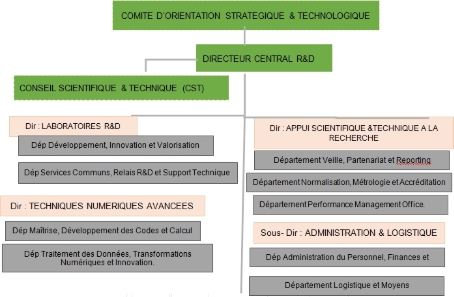

** République Algérienne Démocratique et Populaire 

Ministère de l'Enseignement Supérieur et de la Recherche Scientifique Université M'hamed Bougara - Boumerdès 

Faculté des Sciences \
Département d’Informatique 

**Domaine   :** Mathématiques Informatique   

**Filière    :** Informatique 

**Spécialité  :** Technologie de l’Information 

*N° de l’Arrêté d’habilitation de la spécialité : arrêté n° 1351du 09/08/2016* 

***Mémoire de fin d’études en vu de l’obtention du  Diplôme du Master Professionnel***  

***Thème*** 

**Conception et implémcecontansztion d’une application web pour la gestion des activités et relations**   

**extérieurs** 

***Présenté par :*** 

BENBOUZID*** Rima*** 

DOUMAZ Imene 

***Stage Pratique réalisé au :DCRD***   

***Soutenu le  …../…./ ….. Devant le jury composé de***                        Dr.Marhoum Khireddine   :    Président  

`    `Dr.Rezoug Abdallah    :    Examinateur* 

` `Dr.CHAOUCHE Ali    :     Encadreur*  

`           `MERCHICHI Mohamed Rayane   :     Promoteur(externe)* 

**Dédicace**  

*C’est avec un grand plaisir que je dédie ce* 

*modeste travail :*  

*À l'être le plus cher de ma vie, celle qui m’a donnée que de l’amour et la joie, celle qui m’a soutenu et*  

*encouragée durant ces années d’étude : ma chère* 

*Mère.*  

*À mon support dans la vie, mon précieux offre du dieu, qui doit ma vie, ma réussite et tout mon      respect*  

*celui qui a fait de moi la femme que je suis, mon* 

*chère Père.*  

*À mes chères soeurs « **Feriel** » « **Sara** » pour son* 

*soutien et ses conseils.*  

*À mes chères frères «**Abd** **el** **ghani** » «**Mohamed*** 

***Raouf** » «**Ahmed** **Amine** »*  

*À tous mes amis qui m’ont toujours encouragé, et à qui je souhaite plus du succès, particulièrement*  

*« **Amina** », « **Maroua** », « **Hafsa** », « **Hanane*** 

*»,…*  

*À ma collègue et amie «**Imene** » que je remercie d’avoir tenir jusqu’à la fin, pour sa*  

*patience et sa compréhension tout au long de ce projet.*  

*Et à toutes les personnes qui ont contribué à la* 

*réussite de ce travail.*  

**Rima**

*Du profond de mon cœur, je dédie ce travail à tous ceux qui me sont chers,* 

***À ma chère mère*** 

*Aucune dédicace ne saurait exprimer mon respect, mon amour éternel et ma considération pour les sacrifices que vous avez consentis pour mon instruction et mon bien-être.* 

*Je vous remercie pour tout le soutien et l'amour que vous me portez depuis mon enfance et j'espère que votre bénédiction m'accompagne toujours. Que ce modeste travail soit l'acquittement de vos vœux tant formulés, le fruit de vos immenses sacrifices. Puisse Dieu, le Très Haut, vous accorder santé, bonheur et longue vie.* 

***À mon père*** 

*Je vous remercie pour ton amour inconditionnel, ta patience infinie et tes encouragements constants. Ta force et ton dévouement m'ont toujours inspiré et soutenu.* 

*Ton soutien sans faille et tes nombreux sacrifices. Tu as été un modèle de persévérance et de détermination pour moi.* 

***À mes adorables sœurs**, Meriem et Sarah, pour votre soutien indéfectible et votre amour fraternel. Votre présence a été une source de réconfort et de joie.* 

*À mon très chers frère : **Soufiane***  

*À mes chères copines **Nada** et **Rima***  

*À tous ceux qui me sont chers, à vous tous Merci.* 

*Imene*

**Remerciement**

Ce travail est le fruit d’un effort collectif. Ainsi, il nous est impossible de le conclure sans exprimer notre gratitude à tous ceux qui ont contribué de près ou de loin à sa réalisation.

Nos remerciements d’adressent d’abord à l’éternel tout puissant pour le souffle de vie et pour tous ses bienfaits.

Nous tenons à remercier les membres du jury **MR MARHOUM Khireddine** et **MR REZOUG Abdallah** d’avoir bien accepté de consacrer leurs temps à fin d’évaluer notre travail.

Nous tenons à remercier aussi très vivement **MR CHAOUCHE Ali** ; vous avez été bien plus qu’un simple encadrant pédagogique. Vous avez été un mentor attentionné, toujours prêt

à écouter nos idées, à nous encourager et à nous pousser à donner le meilleur de nous-même. Vos retours constructifs et vos suggestions pertinentes ont contribué à affiner nos réflexions et à améliorer la qualité de notre travail.

Nous tenons à exprimer également notre profonde gratitude et nos remerciements les plus sincères à notre promoteur **MR MERCHICHI Mohamed Rayan** ,pour votre encadrement et votre mentorat pendant cette période de stage. Votre expérience et vos conseils nous ont aidés à grandir professionnellement et à acquérir une compréhension approfondie du monde du travail. Les compétences que nous avons développées grâce à votre encadrement seront un atout précieux tout au long de nos carrière.

**Résumé**

La gestion des relations extérieures (RELEX) est un aspect essentiel de la croissance et de

la compétitivité des entreprises. Ce mémoire explore les défis des méthodes traditionnelles de gestion des relations extérieures chez la **D**irection **C**entrale de **R**echerche et **D**éveloppement (DC-RD) de Sonatrach et propose une solution moderne basée sur l’architecture de microservices. L’application développée vise à améliorer la communication, la coordination et la prise de décision grâce à une automatisation des processus et des analyses en temps réel. Cette approche permet une adaptation rapide aux besoins changeants du marché et garantit une expérience client

de haute qualité pour la DC-RD de Sonatrach, un acteur clé dans le secteur des hydrocarbures

en Algérie.

**Mots clés :** Microservices, Relex, Flask, Docker, API-Getway, MySql![ref1]

**Abstract**

The management of external relations (RELEX) is a crucial aspect of business growth and competitiveness. This thesis explores the challenges of traditional methods for managing external relations at the **C**entral **R**esearch and **D**evelopment **D**irectorate (DC-RD) of Sonatrach and proposes a modern solution based on microservices architecture. The developed application aims to enhance communication, coordination, and decision-making through process automation and real-time analytics. This approach allows for rapid adaptation to changing market needs and ensures a high-quality customer experience for the DC-RD of Sonatrach, a key player in the hydrocarbon sector in Algeria.![ref1]

**Keywords :** Microservices, Relex, Flask, Docker, API-Getway, MySql

**Table des matières**

**Introduction générale 1**

**1 Organisme d’accueil 3**

Introduction . . . . . . . . . . . . . . . . . . . . . . . . . . . . . . . . . . . . . . . . . 4

1  Présentation de l’entreprise SONATRACH . . . . . . . . . . . . . . . . . . . . . 4
1  Les activités de SONATRACH . . . . . . . . . . . . . . . . . . . . . . . . . . . 4
1  Structure de SONATRACH . . . . . . . . . . . . . . . . . . . . . . . . . . . . . 5
1  Présentation du champ d’étude . . . . . . . . . . . . . . . . . . . . . . . . . . . 5
1. Direction Centrale de Recherche et de Développement . . . . . . . . . . 5
1. Objectifs de la DCRD . . . . . . . . . . . . . . . . . . . . . . . . . . . . 6
1. Organigramme de la Direction Centrale de Recherche et de Développement 7
1. Présentation du département de la Direction Technique Numérique Avancée 7

Conclusion . . . . . . . . . . . . . . . . . . . . . . . . . . . . . . . . . . . . . . . . . 8

**2 Etude de l’existant 9 **Introduction . . . . . . . . . . . . . . . . . . . . . . . . . . . . . . . . . . . . . . . . . 10

1  Service des relations extérieures . . . . . . . . . . . . . . . . . . . . . . . . . . . 10
1  Méthodes actuelles de gestion des activités de relations extérieures chez DC-RD 11
1. Gestion des demandes de mission . . . . . . . . . . . . . . . . . . . . . . 11
1. Demande de transport . . . . . . . . . . . . . . . . . . . . . . . . . . . . 12
1. Réservation d’hôtels . . . . . . . . . . . . . . . . . . . . . . . . . . . . . 12
1. Gestion des bons de commande et factures . . . . . . . . . . . . . . . . . 12
3  Défis et limitations de l’existant . . . . . . . . . . . . . . . . . . . . . . . . . . . 14
4  Problématique . . . . . . . . . . . . . . . . . . . . . . . . . . . . . . . . . . . . 14 Conclusion . . . . . . . . . . . . . . . . . . . . . . . . . . . . . . . . . . . . . . . . . 14

Table des matières![ref2]

**3 Solution proposée 15 **Introduction . . . . . . . . . . . . . . . . . . . . . . . . . . . . . . . . . . . . . . . . . 16 1 Architectures logicielles . . . . . . . . . . . . . . . . . . . . . . . . . . . . . . . . 16

1. Objectifs d’une architecture logicielle . . . . . . . . . . . . . . . . . . . . 16
1. Types d’architectures logicielles . . . . . . . . . . . . . . . . . . . . . . . 16
1. Architecture monolithique . . . . . . . . . . . . . . . . . . . . . 16
1. Architecture Orientée Service (SOA) . . . . . . . . . . . . . . 18
1. Architecture MicroServices (MSA) . . . . . . . . . . . . . . . . 20
1. Étude comparative entre les trois architectures . . . . . . . . . 21
3. Justification du choix . . . . . . . . . . . . . . . . . . . . . . . . . . . . . 22 Conclusion . . . . . . . . . . . . . . . . . . . . . . . . . . . . . . . . . . . . . . . . . 23

**4 Analyse et conception 24**

Introduction . . . . . . . . . . . . . . . . . . . . . . . . . . . . . . . . . . . . . . . . . 25

1  Recueil des besoins . . . . . . . . . . . . . . . . . . . . . . . . . . . . . . . . . . 25
1. Besoins non fonctionnels . . . . . . . . . . . . . . . . . . . . . . . . . . . 25
1. Besoins fonctionnels . . . . . . . . . . . . . . . . . . . . . . . . . . . . . 26
2  Démarche adoptée . . . . . . . . . . . . . . . . . . . . . . . . . . . . . . . . . . 27
1. Définition du Langage UML . . . . . . . . . . . . . . . . . . . . . . . . . 27
1. Objectifs d’utilisation de l’UML . . . . . . . . . . . . . . . . . . . . . . . 27
3  Identification des acteurs du système . . . . . . . . . . . . . . . . . . . . . . . . 27
4  Diagramme de cas d’utilisation . . . . . . . . . . . . . . . . . . . . . . . . . . . 28
1. Définition . . . . . . . . . . . . . . . . . . . . . . . . . . . . . . . . . . . 28![ref3]
1. Identification et représentation des cas d’utilisation . . . . . . . . . . . . 29
1. Diagramme de cas d’utilisation général . . . . . . . . . . . . . 29
1. Diagramme de cas d’utilisation « Service missionnaire » . . . . 30
1. Diagramme de cas d’utilisation « gestion des demandes de ![ref4]missions » . . . . . . . . . . . . . . . . . . . . . . . . . . . . . 31
1. Diagramme de cas d’utilisation « Service gestion de transport » 32
1. Diagramme de cas d’utilisation « Service de gestion des réserva-![ref4]

   tions d’hôtel et avion » . . . . . . . . . . . . . . . . . . . . . . 33

5  Diagramme de séquence . . . . . . . . . . . . . . . . . . . . . . . . . . . . . . . 33
1. Définition . . . . . . . . . . . . . . . . . . . . . . . . . . . . . . . . . . . 33![ref3]
1. Diagramme de séquence « S’authentifier » . . . . . . . . . . . . . . . . . 34

   5\.2.1 Description textuelle du cas d’utilisation « S’authentifier » . . 35

3. Diagramme de séquence « Ajouter voiture » . . . . . . . . . . . . . . . . 36

   5\.3.1 Description textuelle du cas d’utilisation « Ajouter voiture » . 37

4. Diagramme de séquence « Demander l’établissement d’ordre de mission » 38

   5\.4.1 Description textuelle du cas d’utilisation « Demander l’établis-

sement d’ordre de mission » . . . . . . . . . . . . . . . . . . . . 39

5. Diagramme de séquence « Traiter demande » . . . . . . . . . . . . . . . 40

   5\.5.1 Description textuelle du cas d’utilisation « Traiter demande » . 41

6. Diagramme de séquence « Effectuer réservation d’hôtel » . . . . . . . . . 42

   5\.6.1 Description textuelle du cas d’utilisation « Effectuer réservation![ref5]

d’hôtel » . . . . . . . . . . . . . . . . . . . . . . . . . . . . . . 43

7. Diagramme de séquence « Effectuer réservation d’avion » . . . . . . . . . 44

   5\.7.1 Description textuelle du cas d’utilisation « Effectuer réservation![ref5]

d’avion » . . . . . . . . . . . . . . . . . . . . . . . . . . . . . . 45

8. Diagramme de séquence « Établir l’ordre de mission » . . . . . . . . . . 46

   5\.8.1 Description textuelle du cas d’utilisation « Établir ordre de

mission » . . . . . . . . . . . . . . . . . . . . . . . . . . . . . . 47

9. Diagramme de séquence « Générer le rapport de fin mission » . . . . . . 48

   5\.9.1 Description textuelle du cas d’utilisation « Générer le rapport

de fin de mission » . . . . . . . . . . . . . . . . . . . . . . . . . 49

6  Diagramme de classe . . . . . . . . . . . . . . . . . . . . . . . . . . . . . . . . . 50
1. Définition . . . . . . . . . . . . . . . . . . . . . . . . . . . . . . . . . . . 50
1. Elaboration du diagramme de classe . . . . . . . . . . . . . . . . . . . . 51

   6\.2.1 Les attributs des classes du diagramme de classes . . . . . . . . 52

3. Schéma relationnel . . . . . . . . . . . . . . . . . . . . . . . . . . . . . . 52 Conclusion . . . . . . . . . . . . . . . . . . . . . . . . . . . . . . . . . . . . . . . . . 54

**5 Implémentation 55 **Introduction . . . . . . . . . . . . . . . . . . . . . . . . . . . . . . . . . . . . . . . . . 56

1  Diagramme de déploiement . . . . . . . . . . . . . . . . . . . . . . . . . . . . . 56
1. Définition . . . . . . . . . . . . . . . . . . . . . . . . . . . . . . . . . . . 56![ref3]
1. Description de diagramme de déploiement du système . . . . . . . . . . 57
2  Architecture MVT . . . . . . . . . . . . . . . . . . . . . . . . . . . . . . . . . . 57
3  Environnement de travail . . . . . . . . . . . . . . . . . . . . . . . . . . . . . . . 58
1. Environnement Soft . . . . . . . . . . . . . . . . . . . . . . . . . . . . . 58
1. Les langages de programmation . . . . . . . . . . . . . . . . . . 58
1. Frameworks . . . . . . . . . . . . . . . . . . . . . . . . . . . . 59
1. Outils de conception . . . . . . . . . . . . . . . . . . . . . . . . 59
1. Environnement de développement . . . . . . . . . . . . . . . . 60
1. Autres technologies . . . . . . . . . . . . . . . . . . . . . . . . 60
2. Environnement Hard . . . . . . . . . . . . . . . . . . . . . . . . . . . . . 60
4  Présentation de l’application . . . . . . . . . . . . . . . . . . . . . . . . . . . . 61
1. Authentification . . . . . . . . . . . . . . . . . . . . . . . . . . . . . . . 61
1. Dashboard administrateur . . . . . . . . . . . . . . . . . . . . . . . . . . 61
1. Dashboard de service mission . . . . . . . . . . . . . . . . . . . . . . . . 62
1. Missions en cours(service mission) . . . . . . . . . . . . . . . . . . . . . . 62
1. Dashboard missionnaire . . . . . . . . . . . . . . . . . . . . . . . . . . . 63
1. Demande d’établissement d’ordre de mission . . . . . . . . . . . . . . . . 63
1. Rapport fin de mission . . . . . . . . . . . . . . . . . . . . . . . . . . . . 64
1. Dashboard service transport . . . . . . . . . . . . . . . . . . . . . . . . . 64
1. Gestion des chauffeurs . . . . . . . . . . . . . . . . . . . . . . . . . . . . 65
1. Dashboard service réservation . . . . . . . . . . . . . . . . . . . . . . . . 65
1. Liste des emails reçus . . . . . . . . . . . . . . . . . . . . . . . . . . . . 66
1. Confirmation des réservations . . . . . . . . . . . . . . . . . . . . . . . . 67
1. Demandes réservations(hôtels non conventionnés) . . . . . . . . . . . . . 67

Introduction . . . . . . . . . . . . . . . . . . . . . . . . . . . . . . . . . . . . . . . . . 68

**Conclusion générale. 69**

**Table des figures**

1. Logo de SONATRACH . . . . . . . . . . . . . . . . . . . . . . . . . . . . . . . . 4
1. Organigramme de la macrostructure SONATRACH . . . . . . . . . . . . . . . . 5
1. Organigramme de la DC-RD . . . . . . . . . . . . . . . . . . . . . . . . . . . . . 7

2\.1 Processus métier . . . . . . . . . . . . . . . . . . . . . . . . . . . . . . . . . . . 13

1. Architecture monolithique. . . . . . . . . . . . . . . . . . . . . . . . . . . . . . . 17
1. Architecture Orientée Service. . . . . . . . . . . . . . . . . . . . . . . . . . . . . 19
1. Architecture microservice. . . . . . . . . . . . . . . . . . . . . . . . . . . . . . . 20
1. Diagramme de cas d’utilisation général . . . . . . . . . . . . . . . . . . . . . . . 29
1. Diagramme de cas d’utilisation « Service missionnaire » . . . . . . . . . . . . . 30
1. Diagramme de cas d’utilisation « gestion des demandes de missions » . . . . . . 31
1. Diagramme de cas d’utilisation « gestion de transport » . . . . . . . . . . . . . 32
1. Diagramme de cas d’utilisation « gestion des réservations d’hôtel et d’avion » . 33
1. Diagramme de séquence « S’authentifier » . . . . . . . . . . . . . . . . . . . . . 34
1. Diagramme de séquence « Ajouter voiture » . . . . . . . . . . . . . . . . . . . . 36
1. Diagramme de séquence « Demander l’établissement d’ordre de mission » . . . . 38
1. Diagramme de séquence « Traiter demande » . . . . . . . . . . . . . . . . . . . 40
1. Diagramme de séquence « Effectuer réservation d’hôtel » . . . . . . . . . . . . . 42
1. Diagramme de séquence « Effectuer réservation d’avion » . . . . . . . . . . . . . 44
1. Diagramme de séquence « Établir ordre de mission » . . . . . . . . . . . . . . . 46
1. Diagramme de séquence « Générer le rapport de fin mission » . . . . . . . . . . 48
1. Diagramme de classe . . . . . . . . . . . . . . . . . . . . . . . . . . . . . . . . . 51
1. Les attributs du diagramme de classes . . . . . . . . . . . . . . . . . . . . . . . 52
1. Diagramme de déploiement du système . . . . . . . . . . . . . . . . . . . . . . . 56
1. Page authentification . . . . . . . . . . . . . . . . . . . . . . . . . . . . . . . . . 61

3. Dashboard administrateur . . . . . . . . . . . . . . . . . . . . . . . . . . . . . . 62
3. Dashboard de service mission . . . . . . . . . . . . . . . . . . . . . . . . . . . . 62
3. Liste des missions en cours(service mission) . . . . . . . . . . . . . . . . . . . . 63
3. Dashboard missionnaire . . . . . . . . . . . . . . . . . . . . . . . . . . . . . . . 63
3. Formulaire de demande d’établissement d’ordre de mission . . . . . . . . . . . . 64
3. Rapport fin de mission . . . . . . . . . . . . . . . . . . . . . . . . . . . . . . . . 64
3. Dashboard service transport . . . . . . . . . . . . . . . . . . . . . . . . . . . . . 65
3. Liste des chauffeurs . . . . . . . . . . . . . . . . . . . . . . . . . . . . . . . . . . 65
3. Dashboard service réservation . . . . . . . . . . . . . . . . . . . . . . . . . . . . 66
3. Emails reçus . . . . . . . . . . . . . . . . . . . . . . . . . . . . . . . . . . . . . . 66
3. Confirmation des réservations en attente . . . . . . . . . . . . . . . . . . . . . . 67
3. Réservations pour les hôtels non conventionnés) . . . . . . . . . . . . . . . . . . 67

**Liste des tableaux**

3\.1 Comparaison entre les architectures logicielles . . . . . . . . . . . . . . . . . . . 22

1. Les acteurs du système . . . . . . . . . . . . . . . . . . . . . . . . . . . . . . . . 28
1. Description textuelle du cas d’utilisation « S’authentifier » . . . . . . . . . . . . 35
1. Description textuelle du cas d’utilisation « Ajouter voiture » . . . . . . . . . . . 37
1. Description textuelle du cas d’utilisation « Demander l’établissement d’ordre de mission » . . . . . . . . . . . . . . . . . . . . . . . . . . . . . . . . . . . . . . . 39
1. Description textuelle du cas d’utilisation « Traiter demande » . . . . . . . . . . 41
1. Description textuelle du cas d’utilisation « Effectuer réservation d’hôtel » . . . . 43
1. Description textuelle du cas d’utilisation « Effectuer réservation d’avion » . . . . 45
1. Description textuelle du cas « Établir ordre de mission » . . . . . . . . . . . . . 47
1. Description textuelle du cas d’utilisation « Générer le rapport de fin de mission » 49
1. Les caractéristiques du PC 1 . . . . . . . . . . . . . . . . . . . . . . . . . . . . . 60
1. Les caractéristiques du PC 2 . . . . . . . . . . . . . . . . . . . . . . . . . . . . . 60

**Introduction générale**

La gestion des relations extérieures (RELEX) est cruciale pour la croissance et l’expansion des entreprises. Elle permet de nouer et de maintenir des liens essentiels avec les clients, partenaires et autres parties prenantes. Cependant, les méthodes traditionnelles de gestion de ces relations, souvent manuelles et décentralisées, présentent de nombreuses lacunes : elles sont lentes, sujettes

à des erreurs et difficiles à coordonner.

Les solutions logicielles modernes viennent pallier ces insuffisances. En centralisant les données et en automatisant les processus, elles améliorent la communication et la coordination. Ces outils offrent également des analyses en temps réel, facilitant une prise de décision plus rapide et plus efficace. Une solution logicielle bien conçue doit être flexible, facile à intégrer aux systèmes existants et évolutive pour s’adapter aux besoins changeants de l’entreprise. L’utilisation de technologies modernes, comme l’architecture de microservices, permet d’assurer une meilleure performance et une plus grande fiabilité.

L’architecture de microservices divise les fonctionnalités complexes en modules indépendants, permettant une personnalisation plus fine et une évolutivité optimale. Chaque microservice peut être conçu pour gérer un aspect spécifique des relations extérieures, comme la gestion des contrats, la communication avec les clients et le suivi des transactions. Cette approche offre une grande souplesse pour répondre aux besoins changeants du marché et garantir une expérience client de haute qualité.

Dans ce contexte, la gestion efficace des relations extérieures est essentielle pour les grandes entreprises comme Sonatrach, un pilier de l’économie algérienne et un acteur clé dans le secteur des hydrocarbures. Ce mémoire se concentre sur la conception et la réalisation d’une application web pour la gestion des Relations Extérieures (RELEX) de la Direction Centrale de Recherche et de Développement (DC-RD) de Sonatrach, en utilisant une architecture de microservices.

Ce memoire est réparti en cinq chapitres :

*Introduction générale![ref2]*

**Chapitre 1** : Dans ce premier chapitre, nous allons introduire l’entité accueillante de DC-RD, ainsi que la structure en question en détaillant son organisation, ses missions et le département d’accueil.

**Chapitre 2** : Dans ce chapitre, nous allons explorer en détail les approches actuelles employées par DC-RD pour superviser les opérations des relations extérieures.

**Chapitre 3** : Dans ce chapitre, nous exposons notre solution envisagée : le développement d’une application basée sur des microservices, choisie après une analyse approfondie des architectures logicielles.

**Chapitre 4** : Dans ce chapitre, nous abordons la méthodologie utilisée pour définir et concevoir le système, ce qui implique l’identification des besoins fonctionnels et non fonctionnels. De plus, nous explorons l’utilisation de l’UML comme outil de modélisation pour représenter de manière structurée les différents aspects du système.

**Chapitre 5** :Ce chapitre présente les différents outils et les langages utilisés pour implémenter notre application et explique le mode d’emploi.

Enfin, ce mémoire sera clôturé par une conclusion qui résumera la solution proposée et présentera quelques perspectives.

**Chapitre 1 Organisme d’accueil**

3
Chapitre 8 *Organisme d’accueil![ref6]*

**Introduction**

Dans ce chapitre, nous allons présenter l’organisme qui nous a accueillis pour effectuer notre stage et énumérer ses activités. Nous allons par la suite présenter la structure organisationnelle de l’organisme, ainsi que la structure qui nous a accueillis, nous présentons son organigramme et ses missions.

1  **Présentation de l’entreprise SONATRACH**

SONATRACH, fondée en 1963 par l’État, est la société nationale chargée de valoriser les réserves en hydrocarbures de l’Algérie. Aujourd’hui, elle est le principal groupe d’hydrocarbures en Afrique et compte parmi les premiers exportateurs mondiaux de gaz et de pétrole. Le groupe opère dans de nombreux centres de forage, tels que Hassi Messaoud, Amenas et In Salah, et possède un vaste réseau de canalisations à travers le pays. En outre, SONATRACH s’investit également dans les énergies électriques et renouvelables. Grâce à ses années d’expérience et de travail, le groupe est devenu une puissance industrielle et commerciale mondiale, contribuant ainsi à l’essor économique durable du pays.[1]

Figure 1.1 – Logo de SONATRACH

2  **Les activités de SONATRACH**

Englobent l’ensemble du processus de production et de commercialisation des hydrocarbures. La société opère dans plusieurs domaines spécialisés, à savoir :

1. **Exploration et Production :** Cette activité consiste à rechercher de nouveaux gisements de pétrole et de gaz afin de maintenir la production et d’accroître les réserves disponibles.[ 2]
1. **Transport par canalisations :** SONATRACH assure le transport et le stockage des hydrocarbures à travers un réseau d’infrastructures de canalisations réparties sur le territoire national.
3. **Liquéfaction et Séparation :** Cette étape implique la transformation des hydrocarbures en produits commercialisables tels que le gaz naturel et la séparation des GPL.[2] 
3. **Raffinage et Pétrochimie :** SONATRACH exploite des installations de raffinage et de pétrochimie pour transformer les produits en carburants et en combustibles, répondant ainsi à la demande du marché national.[2]
3. **Commercialisation :** La société se concentre à la fois sur l’approvisionnement énergétique du marché national et sur la valorisation des hydrocarbures exportés sur le marché international.[2]
3  **Structure de SONATRACH**

La structure de SONATRACH est constituée d’une hiérarchie des directions et départements représentée par l’organigramme suivant[1] :

Figure 1.2 – Organigramme de la macrostructure SONATRACH

4  **Présentation du champ d’étude**
1. **Direction Centrale de Recherche et de Développement**

La Direction Centrale de Recherche et de Développement (DCRD) est une branche de l’organisme SONATRACH chargée de promouvoir et de mettre en œuvre la politique de la recherche appliquée et du développement des technologies dans les métiers de base de la société.

Cette direction représente l’organisme d’accueil de notre stage.[3]

2. **Objectifs de la DCRD**

Dans ce qui suit, nous présentons une liste non exhaustive des différents objectifs liés aux préoccupations de la société concernant la chaîne pétrolière en cas de recherche susceptible d’être érigée en projets. [3] :

- La traduction des préoccupations de la société concernant la chaîne pétrolière en cas de recherche susceptible d’être érigée en projets.
- L’initiation, le développement et la conduite des problèmes à caractère scientifique et technique, rencontrés par les structures opérationnelles.
- La réalisation des études, synthèses, prestations d’analyse et d’expérimentation se rappor- tant notamment aux besoins d’exploitation, de production de transport et de valorisation des hydrocarbures.
- L’introduction et le développement de nouvelles techniques, méthodes d’analyse et d’in- terprétation. - Le soutien et l’assistance aux structures opérationnelles de SONATRACH et ses filiales, par la prise en charge de la résolution des problèmes rencontrés, à caractères scientifique et technique.
- La promotion de l’expertise dans le domaine de l’amont pétrolier.
3. **Organigramme de la Direction Centrale de Recherche et de Développement**

Figure 1.3 – Organigramme de la DC-RD

4. **Présentation du département de la Direction Technique Numé- rique Avancée**

Est un pilier stratégique au sein d’organisation, spécialisé dans l’analyse avancée des données numériques et l’optimisation des supports numériques. Il joue un rôle essentiel en fournissant un accompagnement expert dans la gestion et l’analyse des grandes banques de données, ainsi qu’en développant des solutions innovantes pour améliorer l’interopérabilité des systèmes communicants. De plus, ce département assure un reporting régulier au Directeur Central de la Recherche et Développement, contribuant ainsi activement aux efforts de recherche et d’innovation de l’entreprise.[3]

La direction technique numériques avancées est composées des services suivants :

1. **Département Maîtrise, développement des Codes et Calcul Intensif :** a pour missions :
- La construction d’une équipe de génie logiciel pour assurer le développement interne et la mise à jour continue des logiciels propres à SONATRACH.
- L’aboutissement et la contribution avec les acteurs de SONATRACH, des chercheurs

  associés/consultants/partenaires nationaux et internationaux à la résolution des problèmes qui sont du ressort du numérique et de l’algorithmique en proposant une modélisation adéquate pour leurs implémentations au profit des projets de SONATRACH.

2. **Département traitement des données, transformations numériques et innova- tion :** a pour missions essentielles :
- L’accompagnement, l’assistance et la prise en charge des aspects liés aux supports numériques et l’analyse intelligente des grandes banques de données numériques (optimisation du temps de calcul numérique, fouilles de données et outils statistiques, prédiction analytique, traitement et compression des signaux et leurs visualisations 3D) dans divers projets RD.
- La veille à l’interopérabilité des systèmes communicants acquis et développés avec les systèmes existants.

**Conclusion**

Dans ce chapitre, nous avons mis en lumière l’organisme d’accueil SONATRACH, présenté ses activités diverses ainsi que sa structure organisationnelle, en mettant l’accent sur la Direction Centrale de Recherche et de Développement (DC-RD) concernée par notre étude. Dans le chapitre suivant, nous étudierons l’existant.

8

**Chapitre 2**

**Etude de l’existant**

9
Chapitre 14 *Etude de l’existant![ref6]*

**Introduction**

Dans le cadre de ce chapitre, nous allons explorer en détail les approches actuelles employées par DC-RD pour superviser les opérations des relations extérieures. Notre objectif est de réaliser une étude soigneuse servant à identifier les défis et les limitations de ces approches afin de proposer une solution logicielle basée sur les microservices pour améliorer l’efficacité, la réactivité et la coordination des opérations de communication externe de Sonatrach.

1  **Service des relations extérieures**

Le service des Relations Extérieures connu sous le sigle Relex, occupe une place centrale au sein des entreprises et organisations. Sa mission consiste à gérer et à améliorer les interactions avec divers acteurs externes tels que les clients, les fournisseurs, les partenaires, les autorités réglementaires, les médias et les communautés locales. Ses activités et fonctions principales incluent[4] :

- **Communication externe** : Développement et mise en œuvre de stratégies de commu- nication avec les parties prenantes externes, y compris l’envoi de communiqués de presse, la gestion des réseaux sociaux, les bulletins d’information, etc.
- **Gestion des partenariats** : Identifier, développer et entretenir des partenariats straté- giques avec d’autres entreprises, organisations ou entités externes.
- **Relations publiques** : Gérer la réputation de l’organisation en entretenant des rela- tions positives avec les médias, en organisant des événements publics, en répondant aux préoccupations du public, etc.
- **Analyse de l’environnement externe** : Surveiller et analyser les tendances du mar- ché, les politiques gouvernementales, les changements réglementaires et d’autres facteurs externes pouvant avoir un impact sur l’organisation.
- **Organisation d’événements externes** : Planifier et exécuter des événements externes tels que des conférences, des salons professionnels, des ateliers, etc., pour promouvoir l’image de l’entreprise et renforcer les relations avec les parties prenantes.
- **Gestion des contrats et des accords externes** : Négocier et gérer les contrats et les accords avec les partenaires commerciaux, les fournisseurs et d’autres parties prenantes externes.
- **Formation et développement personnel** : Offre de formations pour développer les

  compétences en relations extérieures.

- **Mise en place de politiques et procédures** : Développement de politiques internes pour garantir la conformité réglementaire et la cohérence de la communication.
2  **Méthodes actuelles de gestion des activités de relations extérieures chez DC-RD**

Chez DC-RD, la gestion des activités de relations extérieures repose principalement sur des méthodes basé sur l’utilisation de Microsoft Excel pour le suivi des données. Voici un aperçu des processus existants pour chaque activité :

1. **Gestion des demandes de mission**

La gestion des demandes de mission implique plusieurs étapes cruciales pour assurer un déroulement efficace des déplacements des employés :

- **Soumission de la demande** : Pour chaque nouvelle mission, les utilisateurs doivent compléter des formulaires papier, détaillant les raisons, les besoins de déplacement et les dates de voyage.
- **Examen et approbation** : Les gestionnaires examinent et approuvent les demandes de mission.
- **Enregistrement des détails de la mission** : Les détails approuvés (dates de voyage, itinéraires) sont enregistrés dans un fichier Excel.
- **Arrangements nécessaires** : Réservation des billets d’avion, véhicules, hébergement, et autres services liés au voyage basés sur les informations enregistrées.
- **Pendant le voyage** : Les employés conservent les reçus des dépenses engagées.
- **Retour et rapport** : À leur retour, les employés soumettent un rapport détaillé incluant les résultats et les dépenses.
- **Archivage** : Toutes les informations de mission sont archivées dans des fichiers Excel pour référence future.
2. **Demande de transport**

Pour diverses missions, les utilisateurs soumettent des demandes de transport, que ce soit par avion ou par route, en remplissant des formulaires papier. Après approbation par la hiérarchie, les détails de ces demandes sont enregistrés dans des fichiers Excel pour assurer le suivi des données, notamment l’état de la flotte du parc. Ce processus nécessite une vérification manuelle de la disponibilité des véhicules et des chauffeurs.

3. **Réservation d’hôtels**

Le processus de demande de réservation d’hôtel suit une démarche similaire de soumission et d’approbation. Les fichiers Excel sont utilisés pour gérer une liste de données relatives aux hôtels conventionnés, incluant leur répartition par région et le contact de chaque hôtel.

4. **Gestion des bons de commande et factures**

Différents services sont inclus pour la gestion des bons de commande et les factures, ce qui permet une certaine spécialisation dans leur gestion. Ce processus débute par la soumission des demandes de réservation de billets de passage pour chaque mission planifiée. Après approbation, les détails sont enregistrés dans des fichiers Excel dédiés pour un suivi précis des dépenses. Les factures reçues sont alors associées aux bons de commande correspondants dans le fichier Excel, vérifiées et payées.

Le processus de déroulement de ces activités est schématisé dans la figure ci-dessous :

Figure 2.1 – Processus métier

3  **Défis et limitations de l’existant**

La dépendance sur des méthodes manuelles et l’utilisation d’Excel comme base de données peuvent conduire à une inefficacité opérationnelle et accroître le risque d’erreurs. Ces approches entraînent des retards significatifs et une disparition des données. Parmi les défis identifiés :

- **Manque d’efficacité et de rapidité** : Les opérations manuelles et le manque d’un système informatique dédié provoquent des retards et une gestion inefficace des activités. Cela risque de rendre l’entreprise moins réactive aux demandes extérieures.
- **Risque d’erreurs** : Les méthodes manuelles augmentent le risque d’erreurs humaines, ce qui peut avoir des conséquences négatives sur la qualité du service et la satisfaction des parties prenantes.
- **Fragmentation des données et des processus** : La gestion des activités à travers différents services et outils peut entraîner une fragmentation des données et des processus. Cela peut rendre la coordination et la cohérence des activités plus difficiles à réaliser.
- **Manque de visibilité** : En raison de la dépendance aux processus manuels et à des outils tels qu’Excel, il peut y avoir un manque de visibilité sur les activités en cours. Cela peut rendre difficile pour les gestionnaires et les parties prenantes de suivre efficacement le statut des projets, des engagements et des ressources disponibles.
4  **Problématique**

Au vu des défis rencontrés par les gestionnaires de service des relations extérieures et dans le cadre de notre projet de fin d’études (PFE), nous proposons la conception et la réalisation d’une solution logicielle. Cette solution vise à améliorer l’efficacité, la réactivité et la coordination des opérations de communication externe de l’entreprise, répondant ainsi aux besoins identifiés par les dirigeants.

**Conclusion**

Au cours de ce chapitre, nous avons pu réaliser une étude minutieuse sur les méthodes actuellement en place de gestion des activités de relations extérieures chez Sonatrach, ce qui nous a permis de soulever pas mal de lacunes et de problèmes que ledit service rencontre face aux différents défis. Notre solution à cette situation serait de mettre en place une application     informatique basée sur les microservices visant à améliorer ces processus et à relever les défis identifiés. Une description détaillée de cette solution sera présentée dans le chapitre suivant.

14

**Chapitre 3 Solution proposée**

15
Chapitre 23 *Solution proposée![ref6]*

**Introduction**

Dans le présent chapitre, nous exposons la solution envisagée à savoir le développement d’une solution logicielle fondée sur une architecture de microservices. En effet, le choix de cette approche était fait en se basant sur une étude solide des différentes architectures logicielles en mettant en relief les avantages de cette approche en matière d’optimisation des processus existants et d’amélioration de la gestion des activités des relations extérieures.

**1 Architectures logicielles**

Une architecture logicielle offre une vision globale et organisée des différents éléments, langages et méthodologies nécessaires pour répondre efficacement aux besoins de demandeur. Une architecture logicielle efficace se caractérise par des couches distinctes et autonomes, allant de l’interface utilisateur aux règles métier et à la persistance, qui constituent le cœur des systèmes d’information.[5]

1. **Objectifs d’une architecture logicielle**

Dans leur livre "Software Architecture in Practice" (3rd edition, 2012), Paul Clements, Len Bass et Rick Kazman ont résumé les principaux objectifs d’une architecture logicielle :

- Simplifier le développement, l’évolution, le déploiement et la maintenance du système.
- Réduire le temps et les coûts associés aux interventions.
- Optimiser la productivité des développeurs face aux changements.
- Faciliter l’ajout ou la modification de fonctionnalités de manière simple et rapide.
- Améliorer l’interopérabilité et la compatibilité avec les autres composants du système d’information.
2. **Types d’architectures logicielles**

Il existe plusieurs types d’architectures logicielles, chacune ayant ses propres avantages et inconvénients. Voici quelques exemples d’architectures courantes :

1. **Architecture monolithique**

L’architecture monolithique est un modèle traditionnel où l’ensemble de l’application est\
conçu comme une seule unité monolithique. Toutes les fonctionnalités de l’application sont\
développées, déployées et mises à jour en tant qu’entité unique et indivisible.[ 6] Dans une architecture monolithique typique, voici les trois niveaux principaux illustrés dans la figure

suivante[7] :

Figure 3.1 – Architecture monolithique.

1. **Interface Utilisateur (côté client)** :

   Cette couche comprend la partie visible de l’application avec laquelle les utilisateurs interagissent. Elle inclut généralement des éléments tels que les interfaces graphiques, les pages web et les applications mobiles. Les utilisateurs utilisent cette interface pour accéder aux fonctionnalités de l’application.

2. **Application (côté serveur)** :

   Cette couche contient la logique métier de l’application. C’est là que les traitements et les calculs spécifiques à l’application sont effectués.Elle gère les requêtes provenant du client (interface utilisateur) et renvoie les réponses appropriées.

3. **Base de Données** :

   La base de données stocke les données utilisées par l’application, telles que des informations sur les utilisateurs, les produits, les commandes, etc. Les données sont stockées de manière structurée et peuvent être récupérées ou mises à jour via des requêtes.

**Avantages :**

- **Simplicité de déploiement** : En raison de sa nature unique, le déploiement d’une

architecture monolithique est relativement simple car il n’y a qu’une seule application à gérer.

- **Facilité de développement initial** : Il est souvent plus rapide et plus simple de développer une application monolithique, car toutes les fonctionnalités sont développées dans un seul environnement.
- **Gestion des données** : Dans une architecture monolithique, les données sont généra- lement stockées et gérées de manière centralisée, ce qui peut simplifier leur manipulation et leur intégrité.
- **Performances accrues** : Les composants d’une architecture unifiée partagent la mémoire vive, ce qui entraîne des performances supérieures par rapport à la communica- tion entre services, qui dépend souvent de mécanismes comme l’IPC (Communications inter-processus).[7]

**Inconvénients :**

- **Complexité croissante** : Avec la croissance de l’application, la complexité du code et des interactions entre les différentes fonctionnalités peut augmenter, rendant le développe- ment et la maintenance plus difficiles.
- **Déploiement risqué** : Le déploiement de mises à jour dans une architecture monoli- thique peut être risqué, car une modification peut potentiellement affecter l’ensemble de l’application.
- **Evolutivité limitée** : L’évolutivité de l’application peut être limitée car toutes les fonctionnalités sont développées et déployées ensemble, ce qui peut rendre difficile l’ajout de nouvelles fonctionnalités sans perturber l’ensemble du système.[7]
2. **Architecture Orientée Service (SOA)**

L’architecture orientée service (SOA) est un modèle architectural où les différentes fonctionna- lités de l’application sont développées et exposées en tant que services distincts et interopérables. Ces services communiquent entre eux via des protocoles standardisés, tels que SOAP (Simple Object Access Protocol) ou REST (Representational State Transfer).[ 8] La figure suivante illustre cette architecture[9] :

Figure 3.2 – Architecture Orientée Service.

**Avantages :**

- **Modularité** : L’architecture SOA favorise la modularité en découpant l’application en services indépendants, ce qui facilite le développement, la maintenance et l’évolutivité du système.
- **Réutilisation des services** : Les services développés dans une architecture SOA peuvent être réutilisés dans différentes parties de l’application ou même dans d’autres applications, ce qui permet un développement plus rapide et une meilleure utilisation des ressources.
- **Interopérabilité** : Les services exposés dans une architecture SOA peuvent être utilisés par des applications développées dans différents langages de programmation ou sur des plateformes différentes, ce qui favorise l’interopérabilité entre les systèmes.[8]

**Inconvénients :**

- **Complexité de gestion** : La gestion des services dans une architecture SOA peut être complexe en raison du nombre élevé de services et de leurs dépendances les uns par rapport aux autres.
- **Surcharge du réseau** : Les échanges de données entre les services dans une architecture SOA peuvent entraîner une surcharge du réseau, en particulier dans les environnements distribués, ce qui peut affecter les performances du système.
- **Dépendance aux standards** : Une architecture SOA dépend fortement des standards de communication, et des écarts par rapport à ces standards peuvent entraîner des problèmes d’interopérabilité entre les services.[8]
3. **Architecture MicroServices (MSA)**

Les microservices sont une architecture logicielle qui divise une application en un ensemble de services autonomes, indépendants et spécialisés, chacun se concentrant sur une tâche spécifique. Plutôt que de développer une application monolithique où toutes les fonctionnalités sont regroupées, les microservices permettent de découper l’application en composants plus petits et modulaires.[10] La figure suivante illustre cette architecture.

Figure 3.3 – Architecture microservice.

**Avantages :**

- **Scalabilité** : Les microservices peuvent être déployés et mis à l’échelle indépendamment les uns des autres. Cela permet d’ajuster la capacité en fonction des besoins spécifiques de chaque service.
- **Flexibilité** : Chaque service est développé indépendamment, ce qui facilite les mises à jour et les modifications. Les équipes peuvent travailler sur des services spécifiques sans perturber l’ensemble de l’application.
- **Réduction des Pannes** : Si l’un des éléments rencontre un problème, cela n’affecte pas les autres services de l’application. Contrairement aux architectures monolithiques, l’application continue de fonctionner pendant la résolution de la panne.
- **Recyclage des Microservices** : Chaque module peut être utilisé dans d’autres

  applications. Les microservices favorisent une meilleure répartition des tâches entre les développeurs.[11]

**Inconvénients :**

- **Complexité de Communication** : La communication entre les différents services peut être complexe. La gestion de multiples services nécessite une attention particulière.
- **Surveillance et Débogage** : La surveillance et le débogage peuvent être plus compli- qués dans un environnement de microservices.
- **Charges Opérationnelles** : La gestion de nombreux services implique des charges opérationnelles supplémentaires. La mise en place d’une infrastructure robuste pour gérer les microservices est essentielle.[11]
4. **Étude comparative entre les trois architectures**

L’analyse comparative porte sur trois architectures logicielles : monolithique, SOA et micro- services, en se concentrant sur les critères suivants :

- **Modularité** : Capacité à diviser un système en parties autonomes (modules) pour

faciliter la maintenance et l’évolutivité.

- **Réutilisation des services** : Possibilité de réutiliser des composants logiciels existants dans différentes parties d’une application.
- **Interopérabilité** : Capacité des services à communiquer entre eux via des interfaces standard.
- **Évolutivité** : Facilité à mettre à jour ou à étendre un système sans perturber les autres parties.
- **Gestion des pannes** : Capacité à minimiser l’impact des pannes sur l’ensemble du système.
- **Charges opérationnelles** : Évaluation des coûts et des efforts associés à la maintenance, à l’administration et à la gestion quotidienne du système.
- **Surveillance et débogage** : Prise en compte des mécanismes de surveillance intégrés et des outils de débogage disponibles pour détecter et résoudre les problèmes opérationnels rapidement.

|**Aspect**|**Architecture Monolithique**|**Architecture SOA**|**Architecture Microservices**|
| - | - | - | - |
|Modularité|Faible|Moyenne|Élevée|
|Réutilisation des services|Limitée|Possible|Étendue|
|Interopérabilité|Dépendante|Standardisée|Indépendante|
|Évolutivité|Limitée|Moyenne|Indépendante|
|Gestion des pannes|Globale|Garantie|Résiliente|
|Charges opérationnelles|Simple|Complexe|Coûteuse|
|Surveillance et Débogage|Simple|Complexe|Spécialisée|

Table 3.1 – Comparaison entre les architectures logicielles

Le tableau 3.1 présente une comparaison entre les trois architectures logicielles selon les critères que nous avons évoqués précédemment.

Ce tableau montre que le choix de l’architecture logicielle appropriée dépend des besoins spécifiques de chaque projet. L’architecture monolithique est une bonne option pour les applica- tions simples et peu évolutives. L’architecture SOA est une bonne option pour les applications plus complexes qui nécessitent une certaine flexibilité et évolutivité. L’architecture microservices est une bonne option pour les applications complexes qui nécessitent une grande flexibilité, évolutivité et résilience.

3. **Justification du choix**

Après avoir examiné les avantages et les inconvénients de chaque architecture, nous avons choisi l’architecture microservices pour les raisons suivantes :

1. **Modularité et réutilisation des services** : L’architecture microservices offre une modularité élevée, ce qui facilite le développement, la maintenance et l’évolutivité du système. De plus, la réutilisation des services dans différentes parties de l’application ou d’autres applications peut contribuer à un développement plus rapide et à une meilleure utilisation des ressources.
1. **Évolutivité** : Les microservices permettent à chaque fonctionnalité d’être développée, déployée et mise à l’échelle indépendamment, ce qui offre une bonne évolutivité et une meilleure utilisation des ressources. Cette flexibilité permettra à l’application de s’adapter facilement à l’évolution des besoins de l’entreprise.
1. **Gestion des pannes** : Les microservices sont conçus pour être résilients et tolérants aux pannes, ce qui garantit une disponibilité continue de l’application même en cas

   de défaillance d’un ou plusieurs services. Cela contribuera à améliorer la réactivité et la satisfaction client en assurant une gestion plus rapide et plus précise des demandes externes.

4. **Interopérabilité** : Les microservices peuvent être développés en utilisant différentes technologies et langages de programmation, offrant ainsi une flexibilité aux développeurs et favorisant l’interopérabilité avec d’autres systèmes.

En adoptant cette solution, DC-RD bénéficiera des éléments suivants :

- **Optimisation des processus** : L’automatisation des tâches manuelles réduira les délais et les erreurs, améliorant ainsi l’efficacité opérationnelle.
- **Centralisation des données** : La consolidation des données dans une seule application facilitera la gestion et l’analyse des informations.
- **Réactivité accrue** : Grâce à une gestion plus rapide et plus précise des demandes externes, la DC-RD pourra améliorer sa réactivité et sa satisfaction client.
- **Évolutivité et souplesse** : L’architecture basée sur des microservices permettra à l’application de s’adapter facilement à l’évolution des besoins de l’entreprise.
- **Cohérence et conformité** : La standardisation des processus garantira une cohérence et une conformité accrues aux politiques et procédures de l’entreprise.

**Conclusion**

Au cours de ce chapitre, nous avons exposé notre approche pour relever le défi de la gestion des activités extérieures actuelles chez la DC-RD. Dans la partie II de ce mémoire notamment la contribution nous nous focalisons sur la conception de l’application en utilisant le langage de modélisation UML.

23

**Chapitre 4**

**Analyse et conception**

24
Chapitre 54 *Analyse et conception![ref6]*

**Introduction**

Dans ce chapitre, nous nous concentrons sur l’identification et la spécification des besoins fonctionnels et non fonctionnels du système. Pour atteindre cet objectif, nous utiliserons divers outils et techniques de modélisation tirés de la littérature, notamment l’UML (Unified Modeling Language), que nous détaillerons plus en profondeur dans la suite de ce chapitre.

1  **Recueil des besoins**
1. **Besoins non fonctionnels**

Les besoins non fonctionnels décrivent les caractéristiques du système qui ne sont pas liées à des fonctionnalités spécifiques mais qui sont cruciales pour garantir sa performance, sa sécurité, sa fiabilité et son évolutivité. Dans le cadre de ce projet, plusieurs besoins non fonctionnels ont été identifiés pour assurer l’efficacité de l’application [12] :

- **Performance et Temps de Réponse** :
- Assurer des performances optimales de l’application, même en cas de charge élevée, avec des temps de réponse rapides.
- Les pages et les fonctions importantes doivent se charger rapidement pour offrir une bonne expérience utilisateur.
- **Sécurité** :
- Assurer la sécurité des données en mettant en place des mesures telles que le cryptage des données, l’authentification sécurisée des utilisateurs, et la gestion des rôles.
- **Fiabilité** :
- L’application doit accomplir les fonctions requises dans les conditions données sans aucune défaillance.
- **Évolutivité** :
- L’application doit pouvoir évoluer facilement pour accueillir plus d’utilisateurs et de fonctionnalités sans ralentir.

En répondant à ces besoins non fonctionnels, l’application de gestion des activités de communi- cation externe pourra offrir une expérience utilisateur fiable, sécurisée et performante, tout en s’adaptant aux besoins évolutifs de la DC-RD.

2. **Besoins fonctionnels**

Les besoins fonctionnels expriment l’action que doit effectuer le système en réponse à une demande. L’application sera conçue en utilisant une architecture de microservices, ce qui permettra une forte modularité. Chaque fonctionnalité spécifique des activités de relations extérieures sera développée en tant qu’un service indépendant, interagissant avec les autres services via des API (Interfaces de Programmation Applicatives).[12]

* **Compte utilisateur** : développement d’un espace personnel pour les utilisateurs employés pour accéder à leurs services et effectuer de multiples tâches, cela comprend :
- Édition du compte personnel.
- La soumission des demandes de mission.
- Consultation des réponses aux demandes.
- Établissement d’un rapport à la fin de chaque mission.
* **Compte Administrateur** : développement d’un Dashboard pour l’administrateur de l’application pour faciliter la gestion de cette plateforme :
- Gestion des comptes utilisateurs.
- Gestion des droits d’accès et des permissions.
* **Compte gestionnaire de service** : développement d’un espace dédié à chaque respon- sable de service pour lui permettre d’accomplir ses tâches. Nous distinguons les services suivants :
  * **Service de gestion des demandes de mission et suivi** :
- Traitement des différentes demandes reçues de la part des employés mission- naires.
- Gestion des missions en cours.
- Établissement d’ordre de mission.
- Routage automatique des demandes approuvées vers les services appropriés.
- Réception des bons de commandes envoyés par les différents autres services.
- Vérification des informations pour s’assurer qu’elles sont complètes, précises et conformes aux politiques et procédures de l’entreprise.
- Enregistrement des bons de commande dans le système, en leur attribuant les numéros de référence appropriés.
- Clôture de mission.
* **Service de gestion de transport** :
- Gestion de la liste des chauffeurs (ajout, modification, suppression).
- Gestion du parc de voitures (ajout, modification, suppression).
- Réservation des voitures et chauffeurs pour les missionnaires.
* **Service de gestion de réservation d’hôtels et d’avion** :
- Réservation des chambres d’hôtels pour les missionnaires.
- Établissement de bons de commande.
- Consultation des réservations en cours.
- Communication avec les compagnies aériennes en effectuant des réservations de billet d’avion.
2  **Démarche adoptée**

Dans le but d’atteindre les objectifs fixés de notre projet, nous avons choisi la modélisation orientée objet avec UML (Unified Modeling Language) comme langage de modélisation.

1. **Définition du Langage UML**

L’UML est décrit comme un langage de modélisation graphique et textuel qui vise à comprendre, décrire, spécifier et documenter les besoins des systèmes, tout en permettant d’esquisser des architectures logicielles, de concevoir des solutions et de communiquer des points de vue.[13]

2. **Objectifs d’utilisation de l’UML**
- Expliquer en détail les fonctionnalités de l’application en construction.
- Faciliter la compréhension de l’enchaînement des tâches de l’application.
- Offrir à l’utilisateur une lisibilité claire et simple.
- Standardiser le travail pour réduire le temps de la conception et de la réalisation.

Avant de commencer à établir les différents diagrammes, il est important de citer les acteurs de notre système d’information.

3  **Identification des acteurs du système**

L’analyse de l’existant que nous avons effectuée nous a permis d’identifier les acteurs ci-dessous :

|**Acteur**|**Rôle**|
| - | - |
|Administrateur Système|Doté d’un nom d’utilisateur et d’un mot de passe pour accéder à son espace, il possède tous les privilèges : ad- ministration des utilisateurs, gestion des comptes et des droits d’accès.|
|Employé / Missionnaire|Tous les employés possèdent d’un compte et peuvent accéder à l’ensemble des services disponibles une fois connectés à leur compte.|
|Gestionnaire de service|Supervise l’ensemble des processus liés à la gestion des activités de service dont il est responsable, notamment en assurant une coordination efficace et un suivi précis des dépenses et des engagements financiers.|

Table 4.1 – Les acteurs du système

4  **Diagramme de cas d’utilisation**
1. **Définition**

Un diagramme de cas d’utilisation illustre les principales fonctionnalités requises par les\
utilisateurs d’un système, offrant ainsi une vue globale du système dans son contexte externe. Il\
établit également la relation entre l’utilisateur et les éléments que le système doit fournir.[14] 

2. **Identification et représentation des cas d’utilisation**
1. **Diagramme de cas d’utilisation général**

Figure 4.1 – Diagramme de cas d’utilisation général

2. **Diagramme de cas d’utilisation « Service missionnaire »**

Figure 4.2 – Diagramme de cas d’utilisation « Service missionnaire »

3. **Diagramme de cas d’utilisation « gestion des demandes de missions »**

Figure 4.3 – Diagramme de cas d’utilisation « gestion des demandes de missions »

4. **Diagramme de cas d’utilisation « Service gestion de transport »**

Figure 4.4 – Diagramme de cas d’utilisation « gestion de transport »

5. **Diagramme de cas d’utilisation « Service de gestion des réservations d’hôtel et avion »**

Figure 4.5 – Diagramme de cas d’utilisation « gestion des réservations d’hôtel et d’avion »

5  **Diagramme de séquence**
1. **Définition**

Diagramme de séquences est un diagramme d’interaction qui expose en détails la façon dont les opérations sont effectuées : « quels messages sont envoyés et quand ils le sont ». Les diagrammes de séquences sont organisés en fonction du temps qui s’écoule au fur et à mesure que la page est parcourue.Les objets impliqués dans l’opération sont répertoriés de gauche à

droite en fonction du moment où ils prennent part dans la séquence.[14]

2. **Diagramme de séquence « S’authentifier »**

Figure 4.6 – Diagramme de séquence « S’authentifier »

**5.2.1 Description textuelle du cas d’utilisation « S’authentifier »**

|**Nom du cas d’utilisation**|S’authentifier|
| - | - |
|**Acteur**|Administrateur, les gestionnaires des services, missionnaire|
|**Objectif**|Permettre l’accès au système|
|**Pré-condition**|Les utilisateurs doivent lancer l’application|
|**Scénario nominal**|
1. L’acteur lance l’application.

2. Le système affiche un formulaire d’authentification.

3. L’acteur saisit son nom d’utilisateur et son mot de passe.

4. Le système vérifie la validité des informations saisies *[Exception1]*.

5. Si l’acteur clique sur "connecter en tant que missionnaire", il est redirigé vers le service missionnaire. *[Exception2]*.
|
|**Scénario alternatif**|
- *Exception1* : Si les informations saisies sont incorrectes, un message d’erreur est affiché.

- *Exception2* : Si l’acteur ne clique pas sur ’connecter en tant que missionnaire’, le système redirige l’acteur vers le service correspon- dant à son rôle.
|

Table 4.2 – Description textuelle du cas d’utilisation « S’authentifier »

3. **Diagramme de séquence « Ajouter voiture »**

Figure 4.7 – Diagramme de séquence « Ajouter voiture »

**5.3.1 Description textuelle du cas d’utilisation « Ajouter voiture »**

|**Nom du cas d’utilisation**|Ajouter voiture|
| - | - |
|**Acteur**|Gestionnaire de service transport|
|**Objectif**|Ajouter une nouvelle voiture|
|**Pré-condition**|Le gestionnaire de service doit être authentifié|
|**Scénario nominal**|
1. Le gestionnaire de service transport clique sur le bouton « Ajouter voiture ».

2. Le système affiche un formulaire d’ajout.

3. Le gestionnaire de service remplit les champs de saisie et clique sur le bouton « Ajouter » pour valider ses informations. *[Exception1]*

4. Le système vérifie les informations saisies. *[Exception2]*

5. Le système sauvegarde la nouvelle voiture.
|
|**Scénario alternatif**|
- *Exception1* : S’il manque des données, le système affiche des messages d’erreurs.

- *Exception2* : Si la voiture existe déjà, un message d’erreur sera affiché.
|
|**Post-condition**|Une nouvelle voiture sera ajoutée|

Table 4.3 – Description textuelle du cas d’utilisation « Ajouter voiture »

4. **Diagramme de séquence « Demander l’établissement d’ordre de mission »**

Figure 4.8 – Diagramme de séquence « Demander l’établissement d’ordre de mission »

.

**5.4.1 Description textuelle du cas d’utilisation « Demander l’établissement d’ordre**

**de mission »**

|**Nom du cas d’utilisation**|Demander l’établissement d’ordre de mission|
| - | - |
|**Acteur**|Missionnaire|
|**Objectif**|Permettre au missionnaire de soumettre une demande d’ordre de mission|
|**Pré-condition**|Le missionnaire doit être authentifié|
|**Scénario nominal**|
1. Le missionnaire clique sur "Passer une demande de mission".

2. Le système affiche le formulaire de demande.

3. Le missionnaire remplit le formulaire et clique sur "Envoyer". *[Ex- ception 1]*

4. Le système enregistre la demande.

5. Le système affiche un message de succès.

6. La demande est envoyée au service mission.
|
|**Scénario alternatif**|
- *Exception 1* : S’il manque des données, le système affiche des mes- sages d’erreur.

- Si la demande est en cours de traitement, des notifications sont affichées.

- Si la demande est traitée avec succès, l’ordre de mission est affiché.
|
|**Post-condition**|La demande est enregistrée et traitée, et le missionnaire est informé du statut de sa demande|

Table 4.4 – Description textuelle du cas d’utilisation « Demander l’établissement d’ordre de mission »

5. **Diagramme de séquence « Traiter demande »**

Figure 4.9 – Diagramme de séquence « Traiter demande »

**5.5.1 Description textuelle du cas d’utilisation « Traiter demande »**

|**Nom du cas d’utilisation**|Traiter demande|
| - | - |
|**Acteur**|Gestionnaire de service|
|**Objectif**|Permettre le traitement des demandes de mission|
|**Pré-condition**|Le gestionnaire de service doit être authentifié|
|**Scénario nominal**|
1. Le gestionnaire de service clique sur "mission" pour afficher les demandes.

(a) Le système récupère et affiche la liste des demandes depuis la BDD via le service mission.

(b) La liste des demandes est affichée.

2. Le gestionnaire de service clique sur "traiter demande " pour traiter une demande spécifique. *[Exception 1]*

3. Le système envoie les informations relatives à la réservation d’avion au service réservation.

(a) Le service réservation traite la demande de réservation d’avion.

4. Le système envoie les informations relatives à la réservation de voiture au service transport.

(a) Le service transport traite la demande de réservation de voiture.

5. Si le champ hôtel n’est pas vide, le système envoie les informations relatives à la réservation d’hôtel.

(a) Le service réservation traite la demande de réservation d’hôtel.

6. Le système affiche les réponses (confirmation des réservations) au gestionnaire de service.
|
|**Scénario alternatif**|
— *Exception 1* : Si l’acteur ne clique pas sur ’traiter demande’, le

système reste sur la page d’affichage des demandes.
|
|**Post-condition**|Le gestionnaire de service reçoit et visualise les confirmations de réserva- tion dans le système|

Table 4.5 – Description textuelle du cas d’utilisation « Traiter demande »

6. **Diagramme de séquence « Effectuer réservation d’hôtel »**

Figure 4.10 – Diagramme de séquence « Effectuer réservation d’hôtel »

**5.6.1 Description textuelle du cas d’utilisation « Effectuer réservation d’hôtel »**

|**Nom du cas d’utilisation**|Effectuer réservation d’hôtel|
| - | - |
|**Acteur**|Gestionnaire de service réservation|
|**Pré-condition**|Le gestionnaire de service réservation doit être authentifié dans le système|
|**Scénario nominal**|
1. Le système récupère les informations de l’hôtel et les enregistre.

2. Le système vérifie si l’hôtel est conventionné.

3. Si l’hôtel est conventionné, le système envoie un email automatique- ment. *[Exception 1]*

4. Le gestionnaire affiche les réponses des emails.

5. Le système récupère et affiche les emails au gestionnaire.

6. Le gestionnaire clique sur ’Confirmation’ et remplit le formulaire. *[Exception 2]*

7. Le système enregistre les informations et affiche un message de succès. Le système génère un PDF du bon de commande.

8. Les informations de la réservation et le PDF sont envoyées au service mission.
|
|**Scénario alternatif**|
- *Exception 1* : Si l’hôtel n’est pas conventionné, le gestionnaire traite la demande pour hôtel non conventionné.

- *Exception 2* : Si des données sont manquantes, le système affiche des messages d’erreur.
|
|**Post-condition**|Les informations de la réservation sont envoyées au service mission|

Table 4.6 – Description textuelle du cas d’utilisation « Effectuer réservation d’hôtel »

7. **Diagramme de séquence « Effectuer réservation d’avion »**

   

Figure 4.11 – Diagramme de séquence « Effectuer réservation d’avion »

**5.7.1 Description textuelle du cas d’utilisation « Effectuer réservation d’avion »**

|**Nom du cas d’utilisation**|Effectuer Réservation d’Avion|
| - | - |
|**Acteur**|Gestionnaire de service|
|**Pre-condition**|Le missionnaire doit être authentifié .|
|**Scénario Nominal**|
1. Le système récupère les informations nécessaires à la réservation d’avion et les enregistre.

2. Le système vérifie les informations enregistrées.

3. Si les informations sont vérifiées avec succès, le système envoie un email automatiquement. [Exception1]

4. Le gestionnaire de service clique pour afficher les réponses des emails.

5. Le système récupère et affiche les emails au gestionnaire de service.

6. Le gestionnaire de service clique sur ’Confirmation’ et remplit le formulaire. [Exception2]

7. Le système enregistre les informations du formulaire et affiche un message de succès.

8. Le système génère un PDF du bon de commande.

9. Les informations de la réservation et le PDF sont envoyées au service mission..
|
|**Scénario Alternatif**|
1. **Exception 1 :** Si la vérification échoue, le gestionnaire doit prendre des mesures supplémentaires.

2. Le système affiche un message d’erreur.

3. **Exception 2 :** Si des données sont manquantes ou incorrectes dans le formulaire.

(a) Le système affiche des messages d’erreur pour les champs

manquants ou incorrects.
|
|**Post-condition**|Les informations de la réservation sont envoyées au service mission.|

Table 4.7 – Description textuelle du cas d’utilisation « Effectuer réservation d’avion »

8. **Diagramme de séquence « Établir l’ordre de mission »**

Figure 4.12 – Diagramme de séquence « Établir ordre de mission »

**5.8.1 Description textuelle du cas d’utilisation « Établir ordre de mission »**

|**Nom du cas d’utilisation**|Établir ordre de mission|
| - | - |
|**Acteur**|Gestionnaire de service|
|**Pré-condition**|Authentification du gestionnaire de service|
|**Scénario Nominal**|
1. Le gestionnaire clique sur "mission".

(a) Le système charge l’interface et affiche les demandes.

2. Le gestionnaire clique sur "envoyer l’ordre de mission".

(a) Le système génère automatiquement le PDF de l’ordre de

mission.

3. Le système envoie l’ordre de mission au service missionnaire. [Ex- ception]
|
|**Scénario Alternatif**|
— *Exception :* Si l’état n’est pas validé, l’ordre de mission reste en

attente.
|
|**Post-condition**|L’ordre de mission est envoyé au service missionnaire.|

Table 4.8 – Description textuelle du cas « Établir ordre de mission »

9. **Diagramme de séquence « Générer le rapport de fin mission »**

Figure 4.13 – Diagramme de séquence « Générer le rapport de fin mission »

**5.9.1 Description textuelle du cas d’utilisation « Générer le rapport de fin de**

**mission »**

|**Nom du cas d’utilisation**|Générer le rapport de fin de mission|
| - | - |
|**Acteur**|Missionnaire|
|**Pré-condition**|Le gestionnaire de service doit être authentifié .|
|**Scénario Nominal**|
1. Le missionnaire clique sur "générer le rapport de fin de mission".

2. Le système charge l’interface de saisie du rapport de fin de mission et l’affiche au missionnaire.

3. Le missionnaire remplit le formulaire et clique sur "envoyer". [Ex- ception 1]

4. Le système génère automatiquement le PDF et enregistre le rapport.

5. Le système envoie un message de succès.

6. Le système envoie le rapport de fin de mission au service mission. [Exception 2]
|
|**Scénario Alternatif**|
1. **Exception 1 :** S’il manque des données, le système affiche des messages d’erreurs.

2. **Exception 2 :** Si le rapport n’est pas envoyé avec succès, le système affiche un message d’erreur.
|
|**Post-condition**|Le rapport de fin de mission est envoyé au service mission.|

Table 4.9 – Description textuelle du cas d’utilisation « Générer le rapport de fin de mission »

6  **Diagramme de classe**
1. **Définition**

Le diagramme de classes est un schéma utilisé en génie logiciel pour représenter les classes, les interfaces et leurs relations dans un système. Il fait partie de la partie statique d’UML, ne traitant pas des aspects temporels et dynamiques [ 15]. Une classe décrit les responsabilités, le comportement et le type d’un ensemble d’objets.

**Remarque :**

- La classe : OrdreMission appartient au service ’mission.’ - Les classes : DemandeMission et RapportFinMission appartiennent au service ’Missionnaire’.
- Les classes : Missionnaire, Admin et GestionnaireService appartiennent au service ’Admin’.
- Les classes : ReservationHotel, Hotel, ReservationAvion, et Avion appartiennent au service’Ré- servation’.
- Les classes : Voiture, Chauffeur et ReservationVoiture appartiennent au service ’Transport’.
2. **Elaboration du diagramme de classe**

La figure suivante représente le diagramme de classe de notre système.

Figure  4.14  – Diagramme de classe

**6.2.1 Les attributs des classes du diagramme de classes**

Figure 4.15 – Les attributs du diagramme de classes

3. **Schéma relationnel**
1. Admin(ID\_admin )
1. GestionnaireServiceTransport(ID\_gestionnaire\_transport )
1. GestionnaireServiceMission(ID\_gestionnaire\_mission )
4. GestionnaireServiceReservation(ID\_gestionnaire\_reservation )
4. Chauffeur(ID\_chauff , nom, prenom, email, contact, dispo)
4. Voiture( ID\_voiture , matricule, marque, type\_voiture, kilometrage, etat, #ID\_chauffeur)
4. ReservationVoiture( ID\_demande , #ID\_chauffeur, #ID\_voiture, #num\_mission, date\_depart, date\_retour, etat)
4. Hotel(ID\_Hotel , nom, email, adresse)
4. avion(ID\_compagnie , nom\_compagnie, email, region)
4. ReservationHotel( ID\_reservation\_hotel , #num\_mission, #ID\_missionnaire, nom\_missionnaire, hotel, num\_chambre)
4. ReservationAvion( ID\_reservation\_avion , #num\_mission, #ID\_missionnaire, nom\_missionnaire, nom\_compagnie\_voyage, num\_billet, classe\_voyage)
4. OrdreMission( ID\_mission , #ID\_missionnaire, nom\_missionnaire, obs\_user, direction, de- partement, mobile\_phone, objectif\_mission, destination, hotel, date\_depart, date\_retour, etat, moyen\_transport\_choisie, num\_chambre, marque\_voiture, type\_voiture, nom\_chauffeur, contact\_chauffeur, compagnie\_voyage, num\_billet, classe\_voyage)
4. DemandeMission( ID\_dmn\_mission , #ID\_missionnaire, nom\_missionnaire, destination, direction, department, numero\_tlf, objectif\_mission, hotel\_souhaite, date\_depart, date\_retour, etat, observations)
4. Missionnaire( ID\_missionnaire , nom, prenom, date\_Naissance, sexe, email, num\_phone, role, username, password)
4. RapportFinMission( ID\_rapport ,#num\_mission, #ID\_missionnaire, nom\_missionnaire, date\_aller\_depart, date\_aller\_arrivee, date\_fin\_depart, date\_fin\_arrivee, moyens\_transport\_aller, moyens\_transport\_retour, hebergement, dinner, dejeuner, observations)

**Remarque :** Les clefs primaires sont soulignées et les clefs étrangères commencent par un

#.

**Conslusion**

Ce chapitre a offert une vue d’ensemble approfondie de notre travail, mettant en lumière l’aspect analytique et conceptuel de l’application à travers divers diagrammes modélisés en langage UML.

Pour la phase d’analyse, nous avons élaboré le diagramme de cas d’utilisation, suivi de la traduction des processus de visualisation des cas d’utilisation en diagrammes de séquence et de classe lors de la phase de conception. Ensuite, nous avons procédé à la conception de la base de données et des tables correspondantes, assurant ainsi une transition fluide vers les étapes suivantes.

Le chapitre suivant sera entièrement dédié à la mise en œuvre et à la réalisation concrète de notre application, consolidant ainsi notre approche méthodique du développement du projet.

54

**Chapitre 5 Implémentation**

55
Chapitre 69 *Implémentation![ref6]*

**Introduction**

Ce chapitre marque la conclusion de la phase de conception de notre application, en abordant la phase cruciale de sa mise en œuvre. L’étape d’implémentation constitue l’aboutissement de tout le processus de conception. Elle se caractérise par une description technique approfondie de l’application conçue, incluant l’architecture logique et physique du système ainsi que les techniques utilisées pour sa réalisation. Nous débutons par présenter le schéma de déploiement du système, suivi de notre sélection d’environnement de travail, comprenant les aspects matériels et logiciels. En outre, nous exposons quelques interfaces pour illustrer le fonctionnement des différentes activités du système.

1  **Diagramme de déploiement**
1. **Définition**

Le diagramme de déploiement en UML représente l’utilisation de l’infrastructure physique par le système et la répartition de ses composants, ainsi que les relations entre eux. Les éléments utilisés incluent des nœuds, des composants, des associations et des artefacts. Les caractéristiques des ressources physiques et des supports sont précisées à travers des stéréotypes.[16]

Figure 5.1 – Diagramme de déploiement du système

2. **Description de diagramme de déploiement du système**

Nous avons adopté une architecture de microservices, qui décompose l’application en services indépendants, chacun exécutant une fonction métier spécifique. Cette approche améliore la gestion et l’évolutivité du système. Voici les composants de notre architecture :

1. **Client :**
- **Web App :** L’application web envoie des requêtes HTTP vers le serveur via l’API Gateway et affiche les réponses reçues. Les utilisateurs interagissent avec l’application pour effectuer diverses opérations comme les réservations et les demandes de mission.
2. **Serveur :**
- **API Gateway :** Point d’entrée unique pour toutes les requêtes HTTP. Elle redirige les requêtes vers les microservices appropriés et gère la communication entre le client et les services.
- **Microservices :** Chaque microservice est indépendant et possède sa propre base de données SQL :

**-Service de Réservation :** Gère les requêtes de réservation et interagit avec sa base de données pour stocker et récupérer les informations de réservation. **-Service Missionnaire :** Gère les missions et utilise sa base de données pour les informations relatives aux missions.

**-Service de Transport :** Traite les demandes de transport et interagit avec sa base de données pour les détails des transports.

**-Service Mission :** Gère les requêtes générales liées aux missions et utilise sa base de données pour les données des missions.

**-Service Admin :** Gère les opérations administratives et interagit avec sa base de données pour les informations administratives.

3. **Bases de Données SQL :** Chaque microservice a sa propre base de données dédiée, assurant une isolation des données et une meilleure performance.
2  **Architecture MVT**

L’architecture MVT (Model-View-Template) est utilisée par le framework Flask. Elle partage des similitudes avec l’architecture MVC (Model-View-Controller) classique, bien que ses concepts soient adaptés pour une flexibilité accrue dans la gestion des templates HTML et la génération dynamique du contenu.

- **Model** : Représente les données et la logique métier. Il gère l’accès, la modification, l’ajout et la validation des données, généralement stockées dans une base de données.
- **View** :Les vues dans Flask sont des fonctions Python (ou des méthodes de classes) qui reçoivent les requêtes HTTP et retournent des réponses. Elles préparent les données à afficher en passant celles-ci à un template.
- **Template** : Les templates dans Flask ont responsables de la présentation des données aux utilisateurs. Ils peuvent intégrer des variables dynamiques et des structures de contrôle pour générer le contenu final des pages web.

Contrairement à MVC, où le contrôleur est une partie distincte gérant les requêtes et les réponses, Flask suit une approche plus flexible où les vues, responsables de la logique de traitement des requêtes et des réponses, remplissent souvent le rôle de contrôleur. Cette approche simplifie le développement en intégrant étroitement la gestion des requêtes et des permissions utilisateur au sein de ses vues.[17]

3  **Environnement de travail**

Un environnement de travail est l’ensemble d’outils et de technologies nécessaires à l’éla- boration d’un système donné. Dans notre travail, nous avons utilisé les outils et les langages suivants :

1. **Environnement Soft**
1. **Les langages de programmation**

**HTML (Hypertext Markup Language) :** C’est un langage qui permet la construction et la structuration des sites web. Nous l’avons utilisé pour définir la structure de notre application web.[18]

**CSS (Cascading Style Sheets) :** Est l’acronyme anglais de Cascading Style Sheets qui peut se traduire par « feuilles de style en cascade ». Le CSS est un langage informatique utilisé sur l’internet pour mettre en forme les fichiers HTML ou XML.[19]

**JavaScript :** C’est un langage de programmation de scripts utilisé pour décrire des mécanismes complexes sur des pages web interactives. Nous l’avons utilisé pour ajouter de l’interactivité à nos pages HTML.[20]

**Python :** C’est un langage de programmation puissant et facile à apprendre. Python est idéal pour l’écriture de scripts et le développement rapide d’applications dans de nombreux domaines.[21]

2. **Frameworks**

**Bootstrap :** C’est un framework css, Il est également composé de plusieurs bibliothèques de ressources. L’infrastructure Bootstrap repose sur HTML, CSS et JavaScript (JS) pour faciliter le développement de sites et d’applications réactives et tout-mobile .[22]

**JQuery :** C’est une bibliothèque JavaScript. Insérer du JavaScript pur (le langage de programmation) dans vos projets web peut changer le comportement de vos pages. Ce langage vient complé- ter le HTML et le CSS de votre site, qui déterminent le contenu

et l’apparence de votre page, en y ajoutant une couche d’interactivité.[ 23]

**Flask :** Flask est un framework web Python léger et flexible, facilitant la création rapide d’applications web avec un seul fichier Python. Il est particulièrement adapté aux nouveaux développeurs en raison de sa simplicité et de sa flexibilité, ne nécessitant pas de structure de répertoire rigide ou de code complexe préalable.[24]

3. **Outils de conception**

**lucidchart :** est une plate-forme de collaboration en ligne, basée sur le cloud, permettant la création de diagrammes et la visualisation de données et autres schémas conceptuels.[25]

4. **Environnement de développement**

**Visual Studio Code :** C’est un éditeur de code source utilisé avec plusieurs langages de programmation, notamment : Java, JavaScript, Node.js, etc. et est disponible sur toutes les platforms Windows, MacOs, Linux. Parmi ses fonctionnalités : La prise en charge du débogage, la complétion intelligente du code, la refactorisation du code et Git intégré. Nous avons utilisé cet outil pour écrire notre code : HTML, CSS, JavaS- cript et Python. Il nous a trop facilité le travail grâce à ces extensions.[ 13]

**MYSQL :** Est un système de gestion de bases de données relationnelles open source développé par Oracle Corporation. Il est largement utilisé pour la gestion et le stockage des données dans diverses applications web et logicielles. MySQL est connu pour sa fiabilité, ses performances élevées et sa facilité d’utilisation. Il utilise le langage SQL (Structured Query Language) pour interagir avec la base de données et prend en charge de nombreuses fonctionnalités avancées telles que la réplication, les transactions et les performances optimisées.[26]

5. **Autres technologies**

**Docker :** est une technologie de virtualisation légère qui facilite la création et la gestion de conteneurs logiciels, ce qui permet aux développeurs et aux équipes DevOps de déployer des applications de manière cohérente et reproductible, indépendamment de leur environnement sous-jacent.[27]

2. **Environnement Hard**

PC 1 PC 2

|Modèle|HP ELITEBOOK|
| - | - |
|Processeur|Intel Core i7-8650U|
|Stockage|SSD|
|Système d’exploitation|Windows 11|
|Architecture|64 bits|
|Modèle|HP ELITEBOOK|
| - | - |
|Processeur|Intel Core i7-10510U|
|Stockage|SSD|
|Système d’exploitation|Windows 11|
|Architecture|64 bits|

Table 5.1 – Les caractéristiques du PC 1 Table 5.2 – Les caractéristiques du PC 2

4  **Présentation de l’application**

Cette partie est dédiée à la mise en valeur de notre solution, nous allons illustrer le fonction- nement de notre application en introduisant les scénarios par acteur.

**Remarque** : Nous essayons de minimiser et de ne pas répéter les formulaires et les tableaux similaires)

1. **Authentification**

Chaque utilisateur de notre application doit s’authentifier avec un nom d’utilisateur et un mot de passe pour pouvoir accéder à ses fonctionnalités.

Figure 5.2 – Page authentification

2. **Dashboard administrateur**

L’administrateur de l’application bénéficie d’un accès privilégié à un tableau de bord avancé qui lui permet de gérer les utilisateurs, d’attribuer des rôles, et de configurer les paramètres de l’application.

Figure 5.3 – Dashboard administrateur

3. **Dashboard de service mission**

L’administrateur de service mission peut superviser les missions en cours en traitant les demandes reçues, générer les ordres de mission, et consulter l’historique des missions clôturées.

Figure 5.4 – Dashboard de service mission

4. **Missions en cours(service mission)**

Le gestionnaire de service mission gère les demandes d’établissement d’ordre de mission.

Figure 5.5 – Liste des missions en cours(service mission)

5. **Dashboard missionnaire**

Le missionnaire peut superviser l’avancement de ses demandes de missions, établir une nouvelle demande et consulter l’historique des missions clôturées.

Figure 5.6 – Dashboard missionnaire

6. **Demande d’établissement d’ordre de mission**

Le missionnaire remplit un formulaire pour demander d’établissement d’ordre de mission .

Figure 5.7 – Formulaire de demande d’établissement d’ordre de mission

7. **Rapport fin de mission**

Le missionnaire peut remplir un formulaire pour décrire les détails de la mission.

Figure 5.8 – Rapport fin de mission

8. **Dashboard service transport**

Le gestionnaire de service transport peut gérer les chauffeurs et les voitures du parc via un tableau de bord, et il peut aussi consulter les demandes de réservation.

Figure 5.9 – Dashboard service transport

9. **Gestion des chauffeurs**

Le gestionnaire de service de transport peut consulter la liste des chauffeurs, modifier et supprimer un chauffeur.

Figure 5.10 – Liste des chauffeurs

10. **Dashboard service réservation**

Le gestionnaire de service réservation bénéficie également d’un tableau de bord pour gérer les demandes de réservation envoyées par le service mission en consultant les emails reçus et en confirmant ces réservations. Il peut également consulter les bons de commande générés pour chaque réservation.

Figure 5.11 – Dashboard service réservation

11. **Liste des emails reçus**

Le gestionnaire de service réservation peut consulter les emails reçus de la part des compagnies aériennes ou des hôtels.

Figure 5.12 – Emails reçus

12. **Confirmation des réservations**

L’administrateur de service réservation confirme les demandes de réservation en cours après consultation des emails reçus.

Figure 5.13 – Confirmation des réservations en attente

13. **Demandes réservations(hôtels non conventionnés)**

Les demandes de réservation pour les hôtels non conventionnés s’affichent dans cette interface.

Figure 5.14 – Réservations pour les hôtels non conventionnés)

**Conclusion**

À travers ce dernier chapitre, nous avons présenté : l’environnement matériel et logiciel de notre projet, le diagramme de déploiement du système, ainsi que le choix du langage de développement. Ensuite, nous avons illustré quelques scénarios de notre travail à travers des captures d’écran témoignant des différentes interfaces contenues dans notre application.

69

**Conclusion générale et perspectives**

Le travail rapporté dans ce mémoire s’inscrit dans le cadre d’un projet de fin d’étude. Il conduit à la conception et au développement d’une application web dédiée à la gestion des relations extérieures au sein de DC-RD. Nous avons conçu et développé cette application en utilisant une architecture de microservices, répondant ainsi aux besoins identifiés dans la problématique. Nous sommes arrivés à la fin de ce projet en développant une application utilisable qui répond globalement aux spécifications des besoins établis au départ. Nous avons opté pour une solution logicielle intégrant des technologies modernes pour améliorer l’efficacité, la réactivité et la coordination des opérations de communication externe. L’application assure la gestion des clients, la sécurité des informations, la gestion des services et des serveurs, ainsi que la relation entre l’entreprise et ses clients en offrant des services compatibles avec leurs besoins.

Au cours de ce travail, nous avons pu améliorer nos compétences, acquérir une expérience significative dans le domaine, rédiger des rapports détaillés et travailler efficacement en équipe. Nous avons présenté les différentes étapes de conception et de réalisation de cette application, en nous basant sur le langage UML pour la modélisation et divers outils et technologies pour le développement. En utilisant principalement la bibliothèque JavaScript ReactJs pour le front-end, le framework de Python Flask pour le back-end, ainsi que les outils Bootstrap et jQuery pour

70

*Conclusion générale et perspectives*

offrir une interface utilisateur facile et ergonomique.

Cependant, cette application peut être enrichie dans ses futures versions par le développement d’une application mobile, l’ajout de langues supplémentaires à l’interface pour une meilleure accessibilité, l’ajout de fonctionnalités de demande d’aide avec l’ouverture d’un ticket de support technique, ainsi que le lancement d’une discussion en ligne (chat) avec un conseiller ou un chatbot.

**Bibliographie**

1. SONATRACH. Histoire de sonatrach. [https://www.sonatrach.com ,](https://www.sonatrach.com) 2023. Consulté le 17/03/2024.
1. Sonatrach. Nos activités, 2024. Consulté le 17/03/2024.
1. SONATRACH. Décision de création de la direction centrale recherche et développement, 2018. SONATRACH, Décision interne, 2018.
1. Banque Africaine de Développement. Communication and external relations. [https://www.afdb.org/fr/about-us/organisational-structure/commu nication-and-external-relations ,](https://www.afdb.org/fr/about-us/organisational-structure/communication-and-external-relations) 2024. Consulté le 18 juin 2024.
1. Paul Clements Len Bass and Rick Kazman. *Software Architecture in Practice* . Addison-Wesley Professional, 3rd edition, 2012. Consulté le 06/04/2024.
1. Mark Richards. *Software Architecture Patterns* . O’Reilly Media, 2015. Consulté le 18 /05/2024.
1. Aurelien Aperraudeau. Architecture monolithique. [https://aperraudeau. medium.com/architecture-monolithique-abc2ae636b51 ,](https://aperraudeau.medium.com/architecture-monolithique-abc2ae636b51) 2023. Consulté le : 22/04/2024.
1. Thomas Erl. *Service-Oriented Architecture : Concepts, Technology, and Design* . Prentice Hall, 2005. Consulté le 18 /05/2024.
1. Blueway. Soa : Décloisonnez votre si. [https://www.blueway.fr/enjeux/ normalisez-et-securisez-vos-echanges/soa-decloisonnez-si ,](https://www.blueway.fr/enjeux/normalisez-et-securisez-vos-echanges/soa-decloisonnez-si) 2024. Consulté le 22/04/2024.

*Bibliographie![ref7]*

10. Chris Richardson. Microservices : Patterns and applications. *Microservices.io* , 2016. Consulté le 18/05/2024.
10. Sarah Johnson. The role of microservices in modernizing enterprise communi- cation. *Enterprise IT Today* , 2018. Consulté le 18/06/2024.
10. Savoir Plus. Besoins fonctionnels et non fonctionnels. [https://savoir.p lus/besoins-fonctionnels-non-fonctionnels/ ,](https://savoir.plus/besoins-fonctionnels-non-fonctionnels/) 2024. Consulté le 22 /05/2024.
10. Fien Van der Heyde and Laurent Debrauwer. *UML 2 : Initiation, exemples et exercices corrigés [2ième édition]* . Édition ENI, 2008.
10. Pascal Roques. *UML 2 par la pratique : Chapitre 1* . Édition Eyrolles, 5ème édition edition, 2006.
10. Lucidchart. Diagramme de classes uml. [https://www.lucidchart.com/pag es/fr/diagramme-de-classes-uml ,](https://www.lucidchart.com/pages/fr/diagramme-de-classes-uml) 2024. Consulté le 22/06/2024.
10. IBM Docs. Topologies et diagrammes de déploiement. [https://www.ibm.co m/docs/fr/rsas/7.5.0?topic=topologies-deployment-diagrams ,](https://www.ibm.com/docs/fr/rsas/7.5.0?topic=topologies-deployment-diagrams) 2024. Consulté le 22/06/2024.
10. GeeksforGeeks. Difference between mvc and mvt design patterns. [https://ge eksforgeeks.org/difference-between-mvc-and-mvt-design-patterns/ , ](https://geeksforgeeks.org/difference-between-mvc-and-mvt-design-patterns/)2024. Consulté le 22/05/2024.
10. Html introduction. [https://www.w3schools.com/html/html_intro.asp , ](https://www.w3schools.com/html/html_intro.asp)Date de la page. Consulté 06/06/2024.
10. Css introduction. [https://www.w3schools.com/css/css_intro.asp ,](https://www.w3schools.com/css/css_intro.asp) Date de la page. Consulté le 06/05/2024.
10. Mozilla. What is javascript? [https://developer.mozilla.org/fr/doc s/Learn/JavaScript/First_steps/What_is_JavaScript .](https://developer.mozilla.org/fr/docs/Learn/JavaScript/First_steps/What_is_JavaScript) Consulté le 24/06/2024.

*Bibliographie![ref7]*

21. Python Software Foundation. The python tutorial. [https://docs.python. org/fr/3/tutorial/ ,](https://docs.python.org/fr/3/tutorial/) 2024. Consulté le 22/06/2024.
21. OpenClassrooms. Créez des sites web responsives avec bootstrap 5. [https: //openclassrooms.com/fr/courses/7542506-creez-des-sites-web-res ponsives-avec-bootstrap-5?archived-source=6391096 ,](https://openclassrooms.com/fr/courses/7542506-creez-des-sites-web-responsives-avec-bootstrap-5?archived-source=6391096) 2024. Consulté le 22/06/2024.
21. OpenClassrooms. jquery, c’est quoi la différence? [https://openclassrooms .com/fr/courses/3504441-introduction-a-jquery/3639626-javascrip t-jquery-cest-quoi-la-difference ,](https://openclassrooms.com/fr/courses/3504441-introduction-a-jquery/3639626-javascript-jquery-cest-quoi-la-difference) 2024. Consulté le 21/06/2024.
21. Pallets Projects. Flask documentation. [https://flask.palletsprojects. com/en/2.2.x/ ,](https://flask.palletsprojects.com/en/2.2.x/) 2022. Consulté le 22/06/2024.
21. Lucid Software Inc. Lucid documentation. [https://lucid.app/documents# /documents?folder_id=recent ,](https://lucid.app/documents#/documents?folder_id=recent) 2024. Consulté le 22/06/2024.
21. MySQL. Mysql : Base de données open source. [https://www.mysql.com/ , ](https://www.mysql.com/)2024. Consulté le 19/06/2024.
21. Docker. Docker builds : Now lightning fast. [https://www.docker.com/ ,](https://www.docker.com/) 2024. Consulté le 23/04/2024.
74

[ref1]: Aspose.Words.abdb1c07-9097-4a79-a5cf-c4730dde83f9.004.png
[ref2]: Aspose.Words.abdb1c07-9097-4a79-a5cf-c4730dde83f9.029.png
[ref3]: Aspose.Words.abdb1c07-9097-4a79-a5cf-c4730dde83f9.051.png
[ref4]: Aspose.Words.abdb1c07-9097-4a79-a5cf-c4730dde83f9.055.png
[ref5]: Aspose.Words.abdb1c07-9097-4a79-a5cf-c4730dde83f9.070.png
[ref6]: Aspose.Words.abdb1c07-9097-4a79-a5cf-c4730dde83f9.164.png
[ref7]: Aspose.Words.abdb1c07-9097-4a79-a5cf-c4730dde83f9.265.png
